# File Manager|dde-file-manager|

## Overview

File Manager is a powerful, simple and easy-to-use file management tool. It follows the classic function and layout of traditional file manager, and simplifies the user operation and adds many features. The open-and-shut navigation bar, the search box with intelligent identification, a variety of views and sorting let you manage files easily. 

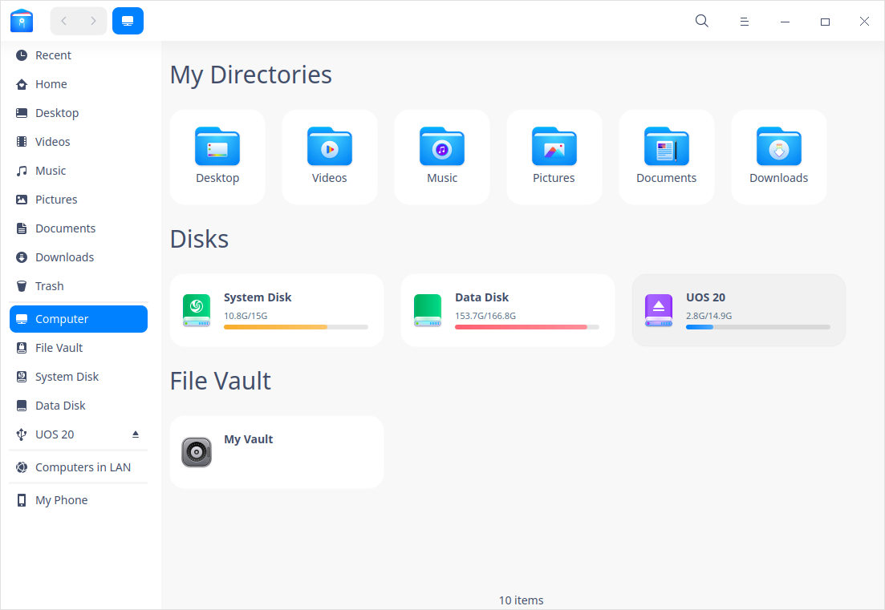

## Guide

You can run, close and create a shortcut for File Manager by the following ways.

### Run File Manager

1. Click  on dock to enter Launcher interface.
2. Locate  by scrolling mouse wheel or searching by "File Manager" in Launcher interface.
3. Right-click , you can
 - Click **Send to desktop** to create a desktop shortcut.
 - Click **Send to dock** to fix the application on dock.
 - Click **Add to startup** to add the application to startup, it will automatically run when the system starts up.

   > Tips: You can also press **Super** + **E** to start File Manager.

### Exit File Manager

- On File Manager interface, click  to exit.
- Right-click  on Dock, select **Close All** to exit File Manager.
- Click  and select **Exit** to exit File Manager.

### View Shortcut Keys

On Document Viewer interface, press **Ctrl + Shift + /** to view all shortcut keys quickly, which helps you to use them skillfully and improves your working efficiency. 

## Main Interface

On File Manager interface, you can execute many operations with the functional bars. It is designed to be easy-to-use, user-friendly and efficient improving.

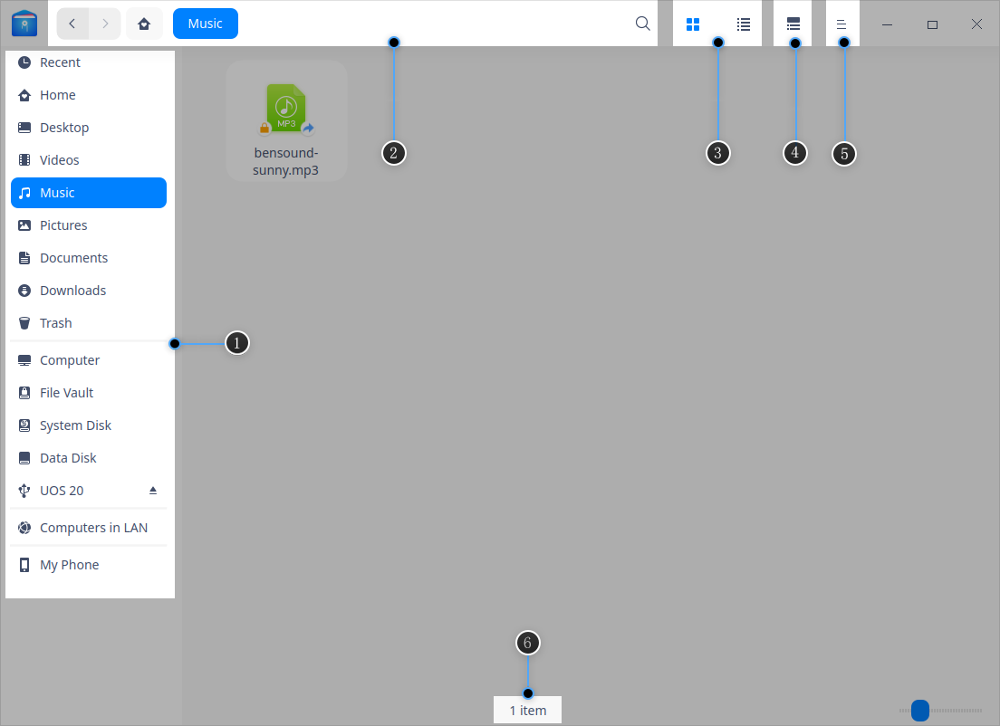

| No. | Name          | Description                                                         |
| ---- | ------------- | ------------------------------------------------------------ |
| 1    | Left panel        | Click icons in left panel to quickly visit local files, disks, computers in LAN, bookmarks and tags. |
| 2    | Address bar        | You can quickly switch visiting history, switch among directory levels, search and input address in address bar. |
| 3    | View | Click  and  to switch view modes. |
| 4    | Info column        | Click  to view basic information and tags of files(folders). |
| 5    | Main menu        | You can create new window, switch themes, set share password, make settings, view manual and application information, and exit the application in Main menu. |
| 6    | Status bar        | You can view the number of files or selected files.                            |

>  Tips: you can drag the dividing line on the right of left panel to change its width.

## Basic Functions

File Manager is featured with the basic functions as a file manager, you can easily create, copy, rename or delete files/folders with it.

### New Document/Folder

#### New Document

1. On File Manager interface, right-click and select **New document**.
2. In the pop-up menu, select the document format you want to create.
3. Input a name for the new document, and press **Enter**, or click at blank area.

#### New Folder

1. On File Manager interface, right-click and select **New folder**.
2. Input a name for the new folder, and press **Enter**, or click at blank area.

### Rename File/Folder

1. Select the file/folder, right-click to select **Rename**.
2. Input a new name for the file/folder, and press **Enter**, or click at any blank area.

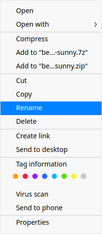

>  Tips: Check "Hide file extension when rename" in **Settings** to rename file more conveniently.

### Batch Rename

1. On File Manager interface, select multiple files.
2. Right-click and select **Rename**.
   - **Replace Text**: Input the content to be replaced in Find box, and input content to rename in Replace box.
   - **Add Text**: Input the content to add in Add box, and select the location.
   - **Custom Text**: Input the file name and SN.
3. Click **Rename** to finish operation.

### View Files

Click  and  on the interface to switch icon view and list view.

- Icon view: displaying filenames, icons or thumbnails.

- List view: displaying file icons or thumbnails, names, time modified, sizes, types and etc in a list. 

>  Tips:
>
> -  In list view, place the cursor on the dividing line between any two columns and drag it to change the width of the current column. Double-click the dividing line to adjust to the biggest width of the current column automatically. 
> - Press  **Ctrl**+**1**  or  **Ctrl**+ **2**  to switch icon view and list view. 

### Sorting

1. Right-click in the blank area on File Manager, select **Sort by**.
2. Choose among the sorting options, which include **Name**, **Time modified**, **Size** and **Type**.

>  Tips: you can click the head of the columns in the list view to change the sort order.

### Open Files

1. On File Manager, right-click the file you want to open.
2. In the context menu, select **Open with**>**Select default program**.
3. Select the application you want to open the file in the list.

>  Notes: It will use the default application to open the file when you double-click it. You can right-click multiple files of the same type, and select **Open with** to open them at a time.

### Hide Files

1. On File Manager, right-click the file you want to hide.
2. Select **Properties**, check **Hide this file**.

### Copy File/Folder

1. Select the files/folders to be copied, right-click and select **Copy**.
2. Enter the directory to which the files/folders will be pasted, right-click and select **Paste**.

### Compress File/Folder

1. Select the files/folders to be compressed, right-click and select **Compress**.
2. Compress interface of Archive Manager pops up. Set the format, name, storage location and so on, click **Compress**.

>  Tips: you can also select **Add to xxx.7z** or **Add to xxx.zip** in the context menu to compress file (folders) quick.

### Delete File/Folder

Right-click file/folder to select **Delete**.
  - You can find the deleted files in Trash. Right-click files in Trash, you can choose **Restore** or **Delete**. 
  - The shortcut of the deleted files will become invalid.

>  Attention: File/folder in external device will be permanently deleted and can not be restored when you select **Delete**.

### Undo Operation
In file manager,  use **Ctrl + Z** to undo the previous steps, including:
- Delete the newly created file/folder.
- Resume the renamed file/folder to the previous name.
- Restore the deleted file/folder from trash.
- Restore the moved (via dragging or cutting) file/folder to the previous location.
- Delete the copied and pasted file/folder.

>  Attention: It can undo two continuous steps at most. If there is file overwriting or permanently file deleting, then you can only return to that step.

### File/Folder Properties

In Properties of files, you can view the basic info, open with list, and permissions. In properties of folders, you can see basic info, sharing info, and permissions.

1. On File Manager interface, right-click a file. 
2. Select **Properties**.

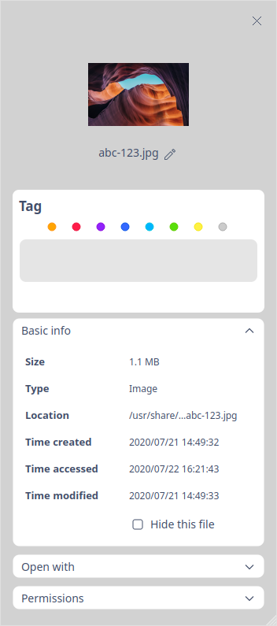

>  Notes: If you check the properties of multiple files at a time, the total size and quantities will be displayed. If you check the properties of a shortcut, the source file location will be displayed in addition. You can use shortcuts **Ctrl + I** to view the properties as well.

### Virus Scan

1. On File Manager interface, right-click a file(folder). 
2. Select **Virus scan**, the **Virus Scan** interface of Security Center pops up, so you can scan the file(folder) for virus. Refer to [Virus Scan](dman:///deepin-defender#Virus Scan) of Security Center for detailed operations.

   > Notes: 
   >- If there is a scanning task in Security Center currently, click **View** in the pop-up dialog box to enter the virus scanning interface of Security Center.
   >- **Add "Virus scan" to the context menu** is enabled by default in Security Center. You can also enter Security Center setting interface and uncheck this function. After unchecking, "Virus Scan" will not be displayed in the context menu.

## Common Operations

File Manager is featured with many useful functions, which are all designed to ease the commonly used operations.

### Switch Address Bar

There are three sections in address bar, namely back/forward buttons, breadcrumb bar, and directory/search bar. By default, breadcrumb bar is displayed in the address bar. 

- Clicking back/forward buttons to quickly view the previous address or the next address. 
- Each level of the location of a file will form a breadcrumb. You can switch quickly among levels by clicking all breadcrumbs.

By clicking the search icon, or right-click the file path and select **Edit address**, the address bar will be switched into inputting box. By clicking out of the inputting box, the address bar will restore to breadcrumbs automatically. 

- The inputting box can identify smartly. You can input keywords or an address and press **Enter**, the system will identify automatically and search or visit.

### Search Files

File Manager supports multiple search methods, including both general search by file name and file content, and advanced search by file type, creation time, and so on, which is helpful to improve efficiency and facilitate file management.

- If you need to search in a specified directory, please enter it before search.

>  Notes: In **Settings**, check "Auto index internal disk" and "Index external storage device after connected to computer" to quicken the searching speed.

#### Full-Text Search

You can search a file by keywords in its content.
1. In File Manager, click  > **Settings**.
2. Check **Full-Text search** under **Index** of **Advanced**.
3. Press **Ctrl + F** or click the searching button in the address bar to start searching. Enter the keywords and press **Enter**.

#### Advanced Search

When there are many files and the search is slow, you can enable advanced search to narrow the search scope and improve the search efficiency.

1. In search bar, input the keywords and press **Enter**. When the results appear, you will see  icon, you can click it to do advanced search.
2. Select the searching range, file type and size, and modified time, accessed time and created time to narrow the search results.

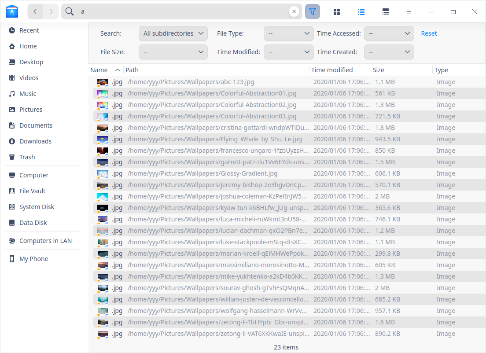

### Recent Files
By default, there is a **Recent** entry on left panel. Click it to view the recently used files. Files are sorted by default in reverse order of access time.

>  Notes: If you want to hide "Recent", you can uncheck "Display recent file entry in left panel" in Settings > Basic > Hidden files. To hide the access record of a specific file, right-click the file and select **Remove** which will not delete the file.

### Manage Tabs

File Manager supports multi-tab view.

1. On File Manager, right-click the folder.
2. In the pop-up context menu, select **Open in new tab**.
3. When the window has multi-tabs, you can:
 - Click + in tab bar to add a new tab.
 - Place the cursor onto the tab, click × on the tab or middle-click to close it.

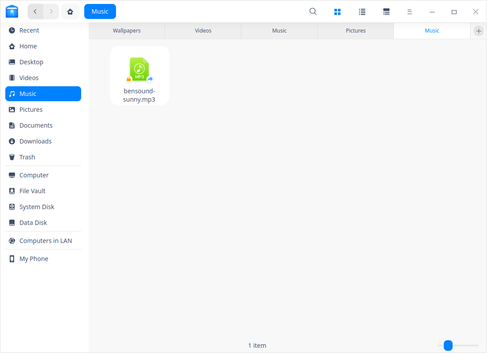

>  Tips: When the File Manager has only one tab, the tab bar is hidden, you can press **Ctrl + T** to add a new tab.

### Manage Bookmarks

To quickly visit a folder from the left panel, you can add bookmarks for frequently used folders.

- Add Bookmarks: On File Manager, right-click the folder, in the pop-up context menu, select **Add to bookmark**.

- Move Bookmarks: you can move bookmarks within the bookmark area. Drag and drop the bookmark to the designated location.

- Delete Bookmarks: you can delete bookmarks by right-clicking the bookmark and select **Remove**, or right-clicking the bookmarked folder and select **Remove bookmark**.

### Manage Tags

By adding tags on file/folder, you can classify and manage your files better.

>  Notes: currently only x86 platform supports **Tag information**. 

#### Add Tags

You can add tag to multiple files/folders at a time, or add multiple tags to a single file/folder. The tag appears in the left panel.

##### By Tag Information

1. Right-click a file/folder, select **Tag information**.
2. Input tag name. Use comma to separate tags in case of multiple tags.
3. Click any blank area to finish adding tag.

>  Notes: The tag color is randomly assigned from eight default colors.

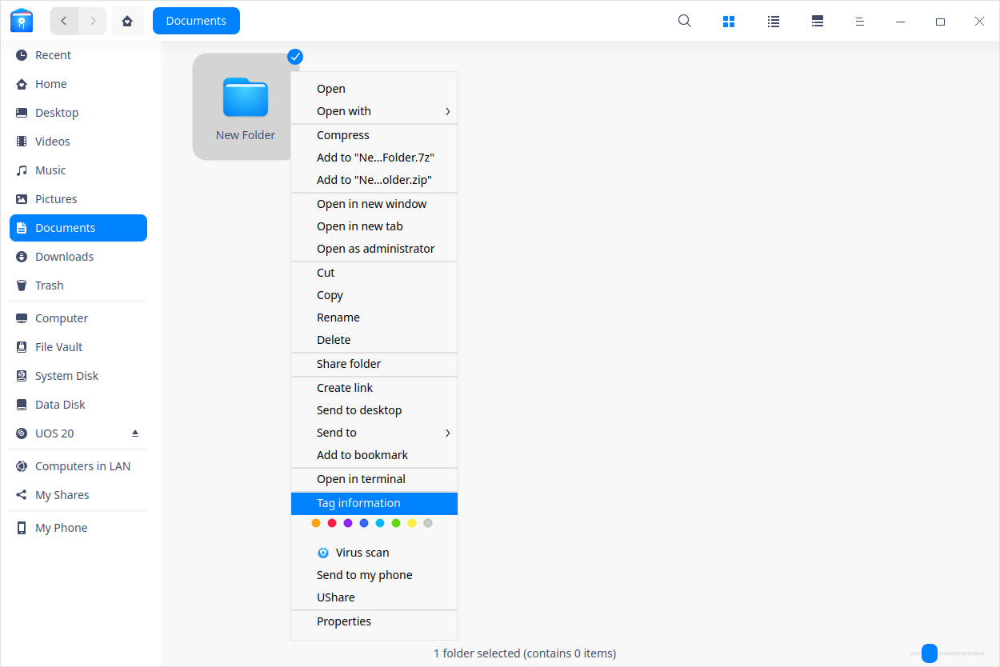

##### By Color Tag

Right-click a file/folder, select a "color button" to create a color tag directly.

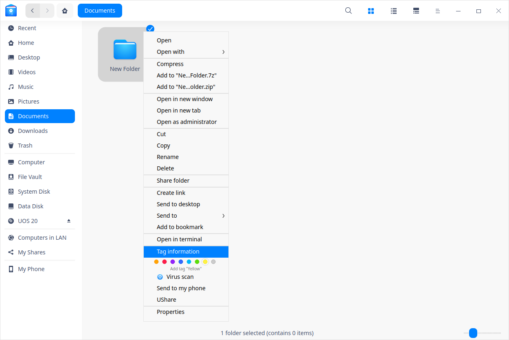

##### By Information Column on the Right Side

Select a file/folder, click , and add tags in the information column on the right side.

>  Notes: If a file has a tag, copy or cut and then paste it, the new file still has the same tag.

#### Rename Tag

Right-click a tag in  the left panel,  select **Rename** to modify the current tag.

#### Change Tag Color

Right-click a tag in  the left panel,  select a "Color button" to change the current tag color.

#### Change Tag Order

Drag and drop the tag upwards or downwards to change its order.

#### Delete Tag
Right-click a tag in left panel,  select **Remove** to delete the tag.

### Preview Files

File Manager supports file preview by pressing space bar. Select a file and press the space bar on the keyboard to quickly preview it. In the preview window, you can view the file info, including image resolution, document size, text content. It also supports gif format, audio and video playback.

#### Preview Video

1. Select a video and press the space bar to start video preview.
2. Click in the preview window to pause video playing.
3. Drag the progress bar to play forward or backward.
4. Click **Open** at the bottom to open the video by default program.

> Notes: You can select multiple files and press space bar to preview them at a time.

### Permission Management
In file/folder properties, click **Permissions** to set **Owner**, **Group** and **Others**. 

### My Shares

You can share folders in File Manager, if there are some folders shared, the share icon will show on the left panel, if not, the share icon will be removed.

#### Share Local Files

1. On File Manager interface, right-click a folder, select **Share folder**.
2. In the properties window, check **Share this folder**.

> Notes: If smb service is not turned on, authentication window pops up. Input password to turn smb on.

3. Input **Share name**, and choose **Permission**, and **Anonymous** according to actual needs before closing the window.
4. To set share password, click  and select **Set share password**.
5. Input password and click **Confirm**.

>  Tips: You can cancel sharing by unchecking **Share this folder**, or right-click the folder and select **Cancel sharing**. 

#### Visit Sharing Folders 

You can find sharing folders of other users in the same LAN in **Computers in LAN**. You can also visit sharing folders via smb.

1. On File Manager interface, click  > **Connect to Server**, input the server address, e.g. smb://xx.x.xx.xxx (usually it should be an IP address), click **Connect**.  Or, input the server's address in the address bar directly and press **Enter**.
2. Double-click the shared document you need to visit, input the username and password in the pop-up window.
   - Unencrypted folders can be visited by anonymous access without inputting username and password.
   - When you visit encrypted folders, a window pops up and you will have to input user name and password before visiting. If you check **Remember password**, you don't have to input password when you visit the folder next time.
      - Username: i.e. the name used by the sharer when logging in the system.
      - Password: i.e. the sharing password set when the sharer shares the folder.  
3. Click **Connect**. 

### Open as Admin

Prerequisite: Please enable **Developer Mode** from Control Center > General Settings.

1. Right-click in the blank area on File Manager. 
2. Select **Open as admin**, input your login password in the pop-up window and click **Confirm**.
3. The file will be opened in a new window, in which you can operate with admin permissions. And you will exit admin permissions when you close this window.

### Open in Terminal

1. Right-click in the blank area on File Manager. 
2. Select **Open in terminal**, Terminal will be opened, and its directory will be the current one.

### Burn CD

You can copy music, video, pictures, or mirror files to a CD or DVD through the burning feature. The ISO9660 file system supports all CD and DVD formats, while the UDF file system only supports some CD formats. 

<table class="block1">
<tr>
<td>Type</td>
<td>Format</td>
<td>ISO9660</td>
<td>UDF</td></tr>
<tr>
<td rowspan="2">Blank disks</td>
<td>DVD-R, DVD+R, CD-R, CD-RW</td>
<td>Supported</td>
<td>Supported</td></tr>
<tr>
<td>Non DVD-R, DVD+R, CD-R, CD-RW</td>
<td>Supported</td>
<td>Not Supported</td></tr>
<tr>
<td rowspan="2">Non blank disks</td>
<td>DVD-R, DVD+R, CD-R, CD-RW</td>
<td>Adding files afterwards is supported.</td>
<td>Only formats burned by primitive tools of Windows are supported.</td></tr>
<tr>
<!--<td>4.1</td>-->
<td>Non DVD-R, DVD+R, CD-R, CD-RW</td>
<td>Adding files afterwards is supported.</td>
<td>Adding files afterwards is not supported</td></tr>   
</table>

1. Insert the disc into the recording drive.

2. Open File Manager and click the CD Icon in the left panel to enter the burning interface.

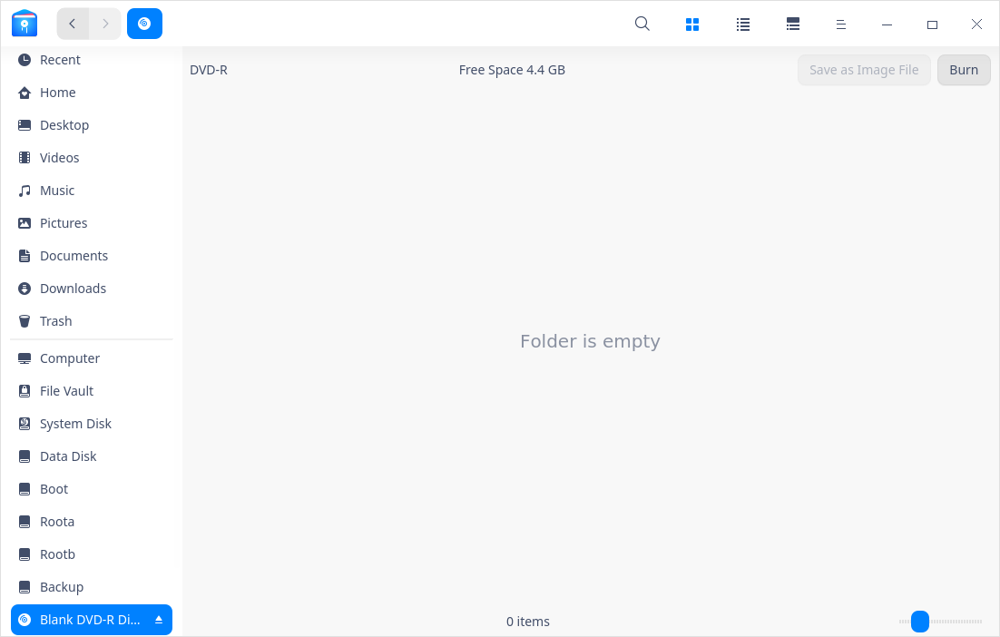

3. Right click the file (folder) and select **Add to disc** or drag the file (folder) directly to the burning interface.

4. In the burning interface, click **Burn** in the upper right corner.

> Notes: if you want to delete a file/folder from the burning list, right-click it and select **Delete** to remove it from the list.

5. A window pops up. Input the disc name. You can also enter the **Advanced settings** interface, set the file system and write speed, or check "Allow files to be added later", "Verify data" and so on, and click **Burn**.

6. After burning, a prompt box will pop up in the interface, and click **OK**.

> Notes: If you need to erase the disc data, you can right-click the disc icon in the left panel and select **Unmount**, right-click the disc icon again and select **Erase**.

### Create Link

1. On File Manager interface, right-click the item to create a link for.
2.  Select **Create link**.
3. In the pop-up window, select a location and input the name of the link.
4. Click **Save** to finish creating the link.

>  Tips: By selecting **Send to desktop** for an item, you can create a link on desktop with one click.

### Send to Other Device

When there is an external device inserted, you can directly send file/folder to it.

1. On File Manager interface, select a file/folder.
2. Right-click and select **Send to**.
3. Select the device you want to send to.
4. File/folder will be copied to the device.

### Send to Bluetooth
If your computer is equipped with Bluetooth module, you can transfer files in short distance through Bluetooth.

Prerequisite: The Bluetooth devices of sender and receiver have been paired and connected successfully. Refer to [Connect to a Bluetooth Device](dman:///dde#Connect to a Bluetooth Device) for details.

1. On File Manager interface, right-click the file or package to be sent.
2. Select **Send to** > **Send to Bluetooth**.
3. Select the receiver in the pop-up window, and click **Next**.  
4. A file receiving request will pop up on the receiving device. After the receiver agrees the request, the sender starts to transfer the file.

## UnionTech OS Assistant

UnionTech OS Assistant is a practical tool to realize cross terminal cooperation, efficient transmission, and real-time synchronization. It only needs to connect the mobile phone and PC, or use wireless delivery to easily transfer pictures, videos, files, etc.

>Notes: Only Android phones are supported.

### Preparation

#### Install UnionTech OS Assistant

1. Click  in the system tray or open File Manager and click **My Phone** in the left panel.

2. Click **Install UnionTech OS Assistant**, a window with a QR code inside pops up.

   - Scan the QR code with your WeChat or browser to download and install UnionTech OS Assistant.
   - Click **Download APK** to download it locally and import it into your phone for installation.

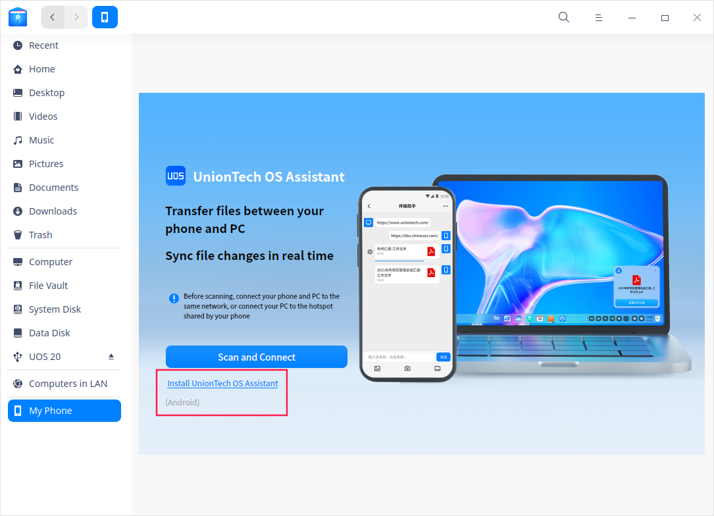

#### Log in UnionTech OS Assistant

There are three ways to log in UnionTech OS Assistant, including: cell phone quick login, WeChat login, and account password login. Please choose one to login. If you haven't registered your account yet, please click **Register** on the login screen to register.

#### Discovery Settings

Use the "Discovery Settings" function to set how your phone and computer are discovered. In the UnionTech OS Assistant screen, click **Discovery Settings** in the upper right corner; on the computer system tray, right-click the icon  and select **Discovery Settings**, you can choose:

- **Discoverable for everyone**: Within the LAN, all devices that are on the same network and in the same network segment are allowed to discover this phone or computer.
- **Discoverable for the same Union ID only**: Within the LAN, only devices logged into the same Union ID are allowed to discover this phone or computer.
- **Undiscoverable**: All devices are not allowed to discover this phone or computer.
- **Discoverable for remote devices with the same Union ID** (computer side): Remote devices logged into the same Union ID are allowed to discover this computer.

 

### Connect PC with Phone

After logging into UnionTech OS Assistant, you can connect your phone to your computer by **Scan and Connect** or **Search Computer**.

#### Scan and Connect

Prerequisite: The phone and the computer are on the same wireless network and in the same network segment.

After the network connection is successful, then perform the following steps.

1. At the computer side, click in the system tray or open File Manager and click **My Phone** in the left panel, "Scan and connect with UnionTech OS Assistant" interface pops up.
2. At the phone side, enter UnionTech OS Assistant interface and click **Scan and Connect**, scan the QR code pops up in step 1.

#### Search Computer

Prerequisite: The phone and the computer are on the same wireless network and in the same network segment (sending files to each other is supported, instead of viewing and editing files), or they have logged into the same Union ID; the phone and computer are discoverable.

1. In UnionTech OS Assistant interface on your phone, click "Search Computer".

2. Select the computer to be connected.

If you need to disconnect, you can:

   - Click  in UnionTech OS Assistant on your phone.
   - Right-click  in the system tray on PC, select your phone and click **Disconnect**.

### Manage Files
After the connection between the mobile phone and PC is successful, files can be transfered, viewed and managed easily.

#### Transfer Files

- **In UnionTech OS Assistant interface**

   Send files from your phone to your computer: In the UnionTech OS Assistant interface, click **Transfer Assistant** and send files to your computer in the transfer window.

- **In File Manager interface**

   Send files from your computer to your phone: In the **File Manager > My Phone** interface, in the transfer window on the right side, you can select a computer file to transfer it in this window; or right-click a file on your computer and select **Send to My Phone**.

- **By wireless delivery**

   When the devices are logged into the same Union ID or in the same wireless network and in the same network segment, and are discoverable, you can transfer files from one device to another through wireless delivery.
   1. On the computer, right-click the file you want to deliver and select **Wireless Deliver**. 

   2. In the pop-up window, select the phone or computer you want to deliver to.

   > Notes:
   >- You need to install UnionTech OS Assistant on the cell phone and log in to your account to receive the files delivered from the computer.
   >- After logging in to the same Union ID, you can perform the remote delivery.

#### View/Edit Files

- View computer files on your phone: In the interface of UnionTech OS Assistant, click **My Computer**, you can open, download or share computer files.
- View/edit phone files from computer side: In the interface of **File Manager > My Phone**, the folders of photo albums, videos, documents, etc. are categorized and displayed, you can open and edit the files in the folders, and the files will be synced to your phone after being edited and saved.

## Add Corner Marker to Files/Folders

You can assign an icon file to a file or folder icon through the command line and display it as a corner marker.
> Notes: 
>- The corner marker files support formats such as svg, jpg, png, bmp, and gif, but not bigger than 100KB.
>- The corner marker could not be added to files in USB disks and CD-ROM disks.

### Add Single Corner Marker

1. Open Terminal, input **gio set xxx(file path)  -t stringv metadata::emblems "xxx(icon path)"**, which means to add a corner marker in the lower right corner of the file/folder icon by default.

> Attention: the special corner markers defined by the system could not be replaced.

2. You can add position codes into the above command to add a corner marker to the upper left corner(lu), lower left corner(ld), upper right corner(ru) or lower right corner(rd).
For example, to add a corner marker to the upper left corner, you have to input:
**gio set xxx(file path)  -t stringv metadata::emblems "xxx(icon path);lu"**

### Add Multiple Corner Markers

To add 2~4 corner markers to a file/folder, you can input "|" in the command to separate multiple paths of the corner marker files. Only one corner marker can be added to the same corner, but you can replace it.

For example, to add 4 corner markers to a file/folder icon, you can input:
**gio set xxx(file path)  -t stringv metadata::emblems "xxx(icon path);lu|xxx(icon path);ld|xxx(icon path);ru|xxx(icon path);rd"**

### Cancel Corner Markers

Open Terminal, input **gio set xxx(file path) -t stringv metadata::emblems ""** to cancel all corner markers on the file/folder icon. 

## File Vault

File Vault is designed to  create a special safe space for you and protect your privacy. With the advanced encryption technology and convenient operations, it's quite easy to use.

### Set Vault Password

You will have to set a password when you use File Vault for the first time as follows:

1. Click  in the left panel or double-click **My Vault** in the **Computer** interface, and then click **Create** in the pop-up dialogue box.  
2. Set the "Method", "Password", "Repeat password" and "Hint", click **Next**. 

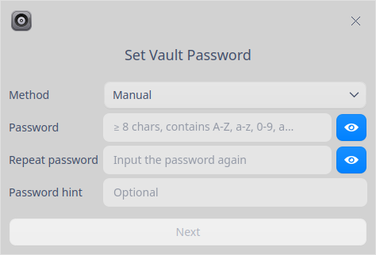

>  Notes: the password must contain upper case letters, lower case letters,  Arabic numbers and special symbols at the same time and no less than 8 digits. Otherwise, you are not able to go to the next step.

3. In the pop up window, set the storage location of the key file, which helps you to retrieve password if you forget it. Click **Next**. 

4. Click **Encrypt**; enter your login password in the pop-up authentication window and click **Confirm**. 

5. Click **OK** when encryption finishes.

### Lock File Vault

After you put files into File Vault, right-click in the left panel or right-click **My Vault** in the **Computer** interface. 

- Select **Lock** to lock File Vault. 
- Select **Auto lock** and select in the sub-menu:
  + Select "Never", which means the file vault remains unlock until the screen is locked or the computer is shutdown. 
  + Select "5 minutes", "10 minutes" or "20 minutes", which means File Vault will be locked automatically in corresponding time. 

### Unlock File Vault

1. Click or double-click **My Vault** in the **Computer** interface. 
2. Input password in the pop-up window and click **Unlock**. 
3. If you forget the vault password, click **Forgot Password?**, select the location where the key file is stored, and then click **Verify Key** to retrieve the password.

>  Tips: You can also right-click  in the left panel or **My Vault** in the **Computer** interface and select **Unlock**. 

### Delete File Vault

You can delete a vault only after unlocking it.

1. Right-click  in the left panel  or right-click **My Vault** in the **Computer** interface and select **Remove File Vault**. 
2. Input file vault password in the pop-up window and click **Remove**. 
3. Input your login password in the pop-up window and click **Confirm** to finish this operation.

>  Attention: Files inside the vault would be deleted as you remove the file vault. Please backup them before you remove the file vault if needed. 

## Disk Management

On File Manager interface, you can manage local and external disks. 

Local disks are displayed in the left panel of File Manager. When you mount any external disks or insert other mobile storage devices, the corresponding icons will be displayed in the left panel.

<table class="block1">
    <caption></caption>
    <tbody>
        <tr>
            <td>Local disks</td>
            <td>All disks of local harddisk divisions</td>
        </tr>
        <tr>
            <td>External disks</td>
            <td>Including mobile hard disks, CDs/DVDs and USB flash disks.</td>
        </tr>
    	<tr>
            <td>Mobile devices</td>
            <td>Including mobile phone storage, storage cards, SD cards and so on.</td>
        </tr>
    </tbody>
</table>

>  Notes: If disks or folders in the disk are encrypted, you will have to input password before visiting them. 

### Local Disks

#### Hide Local Disks

1. Click > **Settings** on the interface of File Manager.
2. Check **Hide system disk** under **Advanced** > **Other**.

#### Rename Local Disks

1. Right-click a local disk in the left panel or in the computer interface.
2. Select **Rename**.
3. Input the new name and press **Enter** or click any blank area to save the modification.

>  Tips: In the computer interface, double click any local disk slowly, after the editing box appears, you can rename it directly.

### External Disks

#### Eject External Disks

1. In the left panel of File Manager, right-click the disk you want to remove.

2. Select **Safely Remove**.

3. The disk will be removed from the disk list, and so will all partition of it .

>  Tips: you can also select **Eject** or click  in the left panel to unmount the disk.

#### Rename External Disks

1. In the left panel or on computer interface, right-click the disk you want to rename.
2. Select **Unmount** and then select **Rename**.
3. Input the new name and press **Enter** or click any blank area to save the modification.

#### Format External Disks

1. In the left panel of File Manager, right-click the disk to format.

2. Select **Unmount** and then select **Format**.

3. In the pop-up window, choose the type and volume label for the disk.

4. Click **Format**.

   

>  Notes: If you check **Quick Format**, the disk can be formatted quickly in a few seconds, but the data could be restored by file recovery tools. If you don't want these data to be restored, you can uncheck this option box and format the disk.

## Main Menu

You can create new window, switch themes, connect to server, set share password (see [Share Local Files](#Share Local Files)), make settings, view manual and version information in Main Menu.

### New Window

1. Click on the interface.
2. Select **New window** to open a new window.

### Connect to Server

You can [visit sharing folders](#Visit Sharing Folders) by connecting to server.

1. Click on the interface.
2. Select **Connect to Server**, input server's IP address (XX.XX.XX.XX) in the editing box.
   - Click  to add the address into **My Favorites**.
   - Select an address from **My Favorites** and click  to delete in from **My Favorites**.
3. Click **Connect**.

### Settings

#### Basic

1. Click > **Settings** on the interface of File Manager.
2. Select **Basic**.
   - You can check **Always open folder in new window**
   - You can set whether to open folder by one click or double click.
   - You can select a directory under **Open from default window** or **Open in new tab**. 
   - You can set up the icon size.
   - You can set the **Default View** as icon view or list view.
   - Check **Show hidden files** to show all hidden files.
   - Check **Hide file extension when rename**, so the extension would not be displayed when renaming.
   - Check **Display recent file entry in left panel**, then the recently visited file would be displayed in left panel.

#### Advanced

1. Click > **Settings** on the interface of File Manager.
2. Select **Advanced**.
   - You can check **Auto index internal disk**, when you search files, the files in internal disks would be searched.
   - You can check **Index external storage device after connected to computer**, In **Index**, when you search files, the files in the external disks would be searched as well.
   - You can check **Full-Text search** to search by content.
   - You can select which types of files can be previewed.
   - You can check **Auto mount**, when any external disks connect to the computer, they would be mounted automatically. 
   - You can check **Open after auto mount**, when any external disks connect to the computer, they would be mounted automatically and opened. 
   - Check **Show item counts and sizes in the path of  mounted MTP devices** to display the status bar information at the bottom of the MTP device's path after it is mounted.
   - Check **Keep showing the mounted Samba shares** to show the remote mount link always in the left panel.
   - You can check **Use the file chooser dialog of File Manager**, when selecting files, File Manager window would be opened.
   - You can check **Ask for my confirmation when deleting files**, when deleting files, a hint dialog would pop up.
   - You can check **Hide system disk**, local disks would not be displayed in left panel and computer interface. 
   - You can check **Show file system on disk icon**.

### Theme

The window theme includes Light Theme, Dark Theme and System Theme.

1. Click on the interface.
2. Click **Theme** to select one.

### Help

1. Click on the interface.
2. Click **Help** to view the manual.

### About

1. Click on the interface.
2. Click **About** to view version information and introduction about File Manager.

### Exit

1. Click on the interface.
2. Click **Exit**.
