# 檔案管理員|dde-file-manager|

## 概述

檔案管理員是一款功能強大、簡單易用的文件管理工具。它沿用了一般檔案管理員的經典功能和佈局，並在此基礎上簡化了用戶操作，增加了很多特色功能。檔案管理員擁有一目了然的導航欄、智能識別的搜索框、多樣化的視圖和排序，這些特點讓文件管理不再複雜。

## 使用入門

通過以下方式運行或關閉檔案管理員，或者創建檔案管理員的快捷方式。

### 運行檔案管理員

1. 單擊任務欄上的啟動器圖標 ，進入啟動器界面。
2. 上下滾動鼠標滾輪瀏覽或通過搜索，找到檔案管理員圖標 ，單擊運行。
3. 右鍵單擊 ，您可以：
 - 單擊 **傳送到桌面**，在桌面創建快捷方式。
 - 單擊 **傳送到任務欄**，將應用程序固定到任務欄。
 - 單擊 **加至開機啟動**，將應用程序添加到開機啟動項，在電腦開機時自動運行該應用。

> 竅門：您也可以使用快捷鍵 **Super + E** 啟動檔案管理員。

### 關閉檔案管理員

- 在檔案管理員界面，單擊 ，關閉檔案管理員。
- 在任務欄右鍵單擊 ，選擇 **關閉所有**，關閉檔案管理員。
- 在檔案管理員界面，單擊 ，選擇 **退出** ，關閉檔案管理員。

### 查看快捷鍵

在檔案管理員界面，使用快捷鍵 **Ctrl + Shift + /** 打開快捷鍵預覽界面。熟練地使用快捷鍵，將大大提升您的操作效率。

## 主界面

檔案管理員的主界面簡單易用、功能全面，熟練地使用界面功能將使檔案管理更加簡單高效。

| 標號 | 名稱          | 描述                                                         |
| ---- | ------------- | ------------------------------------------------------------ |
| 1    | 導航欄        | 單擊導航圖標，快速訪問本地文件、磁盤、共享文件、書籤、標記等。 |
| 2    | 地址欄        | 通過地址欄，快速切換訪問歷史、在上下級目錄間切換、搜索、輸入地址訪問。 |
| 3    | 圖標/列表視圖 | 單擊  , 圖標，以圖標或列表形式查看文件（夾）。 |
| 4    | 訊息欄        | 單擊 ， 查看文件（夾）的基本訊息和標記。 |
| 5    | 菜單欄        | 通過主菜單，您可以新建窗口、切換窗口主題、設置共享密碼、設置檔案管理員、查看幫助文檔和關於訊息、退出檔案管理員。 |
| 6    | 狀態欄        | 顯示文件數量或者已選中文件的數量。                           |

> 竅門：可拖動左側導航欄右邊的分隔線來改變其寬度。

## 基本功能

檔案管理員具備基本的檔案管理功能，對文件（夾）進行新建、複製、重命名、刪除等操作都非常簡單。

### 新建文件

#### 新建文檔

1. 在檔案管理員空白區域，單擊鼠標右鍵。
2. 選擇 **新建文檔**。
3. 選擇新建文件的類型。
4. 輸入新建文檔的名稱。

#### 新建文件夾

1. 在檔案管理員空白區域，單擊鼠標右鍵。
2. 選擇 **新建文件夾**。
3. 輸入新建文件夾的名稱。

### 重命名文件

1. 在檔案管理員界面，右鍵單擊文件。
2. 選擇 **重命名**。
3. 輸入文件名稱，按 **Enter** 鍵或者單擊界面空白區域保存設置。

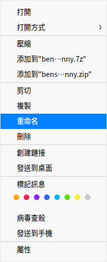

> 竅門：在 **設置** 中勾選「重命名時隱藏文件擴展名」，能更方便地修改文件名稱。

### 批量重命名

1. 在檔案管理員界面，選中多個文件。
2. 右鍵單擊文件，選擇 **重命名**。
   - **替換文本** 查找需要替換的文本，並輸入替換後的文本，文件名中的關鍵字將被統一替換。
   - **添加文本** 輸入需要添加的文本，並選擇位置是名稱之前還是之後，文件名將統一加入被添加的文本。
   - **自定義文本** 輸入文件名，並輸入序列的遞進數字，文件名將統一改成新文件名+遞進數字。
4. 單擊 **重命名** 來完成操作。

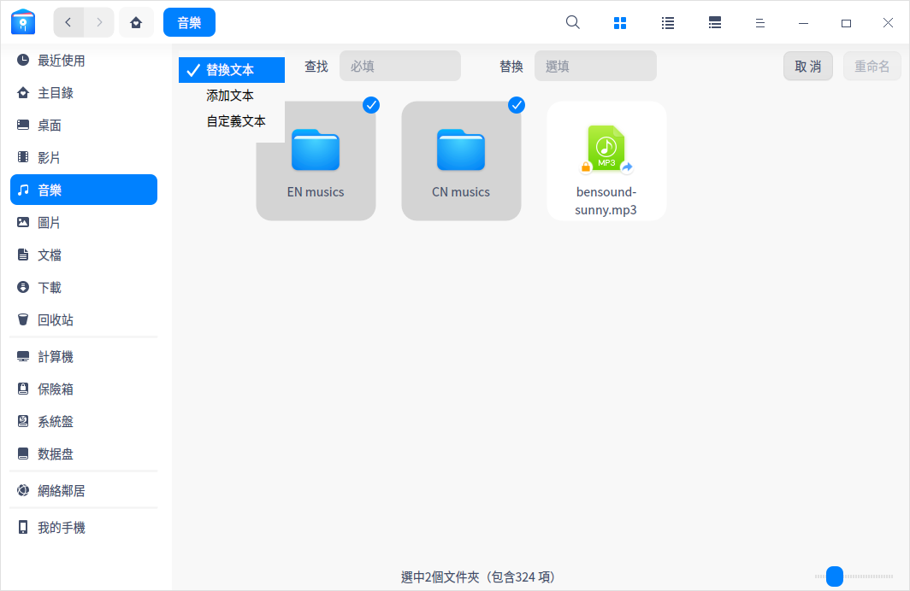

### 查看文件

單擊菜單欄上的圖標  、 來切換圖標視圖和列表視圖。

- 圖標視圖：平鋪顯示文件的名稱、圖標或縮略圖。

- 列表視圖：列表顯示文件圖標或縮略圖、名稱、修改時間、大小、類型等訊息。

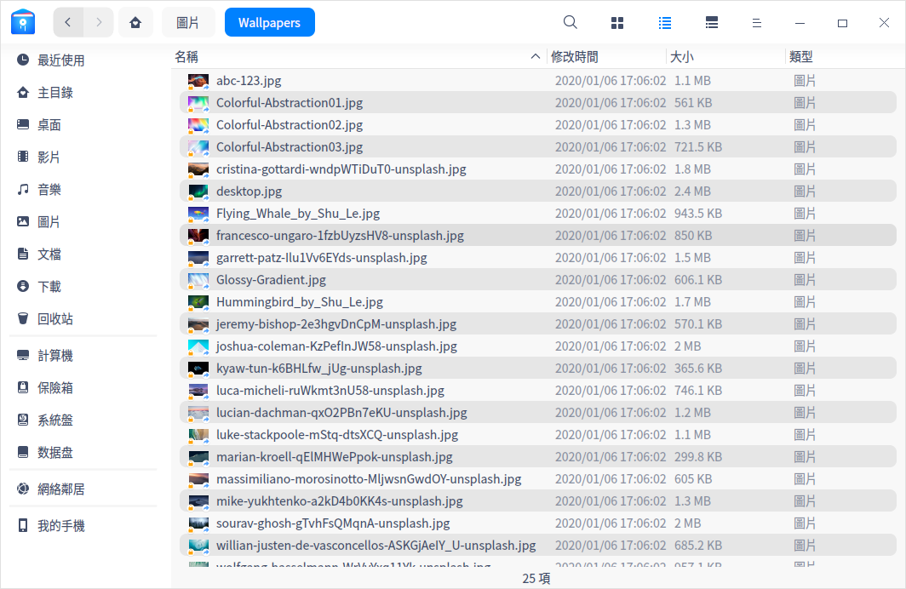

> 竅門：
> - 在列表視圖中，把光標置於兩列之間的分隔線上， 拖動它來改變列的寬度；雙擊分隔線可將當前列自動調整為本列內容最寬的寬度。
> - 使用 **Ctrl + 1** 和 **Ctrl + 2** 快捷鍵，切換圖標視圖和列表視圖。

### 排序文件

1. 在檔案管理員空白區域，單擊鼠標右鍵。
2. 選擇 **排序方式**。
3. 在子菜單中選擇以名稱、修改時間、大小或類型來排序文件。

> 竅門：在列表視圖中，單擊表頭欄的列標籤來切換升序、降序。

### 打開文件

1. 在檔案管理員界面，右鍵單擊文件。
2. 選擇 **打開方式** > **選擇默認程序**。
3. 在程序列表中選擇應用程序。

> 說明：直接雙擊文件會使用默認程序打開。您可以選擇相同類型的多個文件，單擊右鍵選擇 **打開方式** 選項，一次打開多個文件。

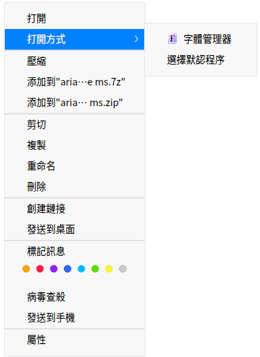

### 隱藏文件

1. 在檔案管理員界面，右鍵單擊文件。
2. 選擇 **屬性**，勾選 **隱藏此文件**。

### 複製文件

1. 在檔案管理員界面，右鍵單擊文件。
2. 選擇 **複製**。
3. 選擇一個目標存儲位置。
4. 單擊鼠標右鍵，選擇 **黏貼**。

### 壓縮文件

1. 在檔案管理員界面，右鍵單擊文件（夾）。
2. 選擇 **壓縮**。
3. 彈出歸檔管理器壓縮界面，可以設置壓縮包格式、名稱、存儲路徑等，單擊 **壓縮**。

> 竅門：您也可以直接在右鍵菜單中選擇 **添加到xxx.7z** 或 **添加到xxx.zip**，快速將文件（夾）壓縮成7z或zip格式。

### 刪除文件

1. 在檔案管理員界面，右鍵單擊文件。
2. 選擇 **刪除** 。
   - 被刪除的文件可以在回收站中找到，右鍵單擊回收站中的文件可以進行 **還原** 或 **刪除** 操作。
   - 被刪除的文件的快捷方式將會失效。

> 注意：从外接設備中刪除文件會將文件徹底刪除，無法從回收站找回。

### 撤銷操作

在檔案管理員中，可以用 **Ctrl + Z** 來撤銷上一步操作，包括：

- 刪除新建的文件。
- 恢復重命名（包括重命名文件後綴）之前的名字。
- 從回收站還原剛刪除的文件。
- 恢復文件到移動（剪切移動、鼠標移動）前的原始路徑。
- 刪除複製黏貼的文件。

>注意：撤銷動作最多只能返回兩步；如果操作中有覆蓋某個同名文件和徹底刪除文件，則撤銷只能返回到這一步。

### 文件屬性

文件屬性會顯示文件的基本訊息、打開方式和權限設置。文件夾屬性會顯示文件夾的基本訊息、共享訊息和權限設置。

1. 在檔案管理員界面，右鍵單擊文件。
2. 選擇 **屬性**，查看文件屬性。

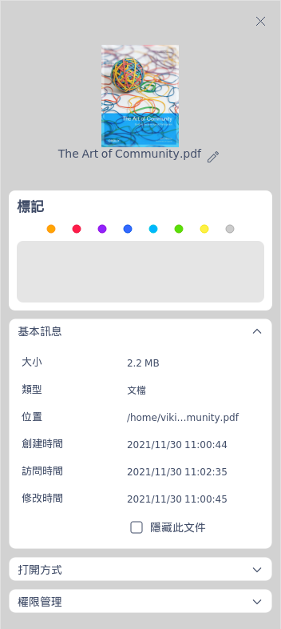

> 說明：查看多個文件屬性會顯示文件總大小和數量；查看快捷方式的屬性將會額外顯示源文件地址。您還可以使用 **Ctrl + I** 組合鍵查看文件屬性。

### 病毒查殺

1. 在檔案管理員界面，右鍵單擊文件（夾）。
2. 選擇 **病毒查殺**，彈出安全中心病毒查殺界面，您可以對該文件（夾）進行安全掃描，具體操作請參閱安全中心 [病毒查殺](dman:///deepin-defender#病毒查殺)。

> 說明：
> - 如果當前安全中心有查殺任務，則在彈出的對話框中單擊 **查看** 進入安全中心病毒查殺界面進行查看。
> - 安全中心默認開啟 **加入「病毒查殺」到文件右鍵菜單** 的功能，您也可以進入安全中心設置界面，取消勾選該功能。取消勾選後檔案管理員右鍵菜單中不會顯示病毒查殺的選項。

## 常用操作

檔案管理員具備很多特色功能，這些功能都讓檔案管理更加簡單、高效。

### 切換地址欄

地址欄由歷史導航、麵包屑和輸入框共同組成。通常情況下地址欄顯示麵包屑。

- 單擊歷史導航按鈕，快速在歷史瀏覽記錄間切換，查看前一個地址或者後一個地址。
- 文件所在位置的每一個層級都會形成一個麵包屑，通過來回單擊麵包屑可以快速在不同文件層級間切換。

單擊搜索圖標，或者在文件路徑上單擊右鍵並選擇「編輯地址」，地址欄會切換為輸入框狀態。在輸入框外單擊時，地址欄會自動恢復到麵包屑狀態。

- 輸入框帶有智能識別功能，輸入關鍵詞或者訪問地址，系統會自動識別並進行搜索或訪問。

### 搜索文件

檔案管理員支持多種檢索方式，既支持通過文件名稱、文件內容進行普通搜索，也支持通過文件類型、創建時間等進行高級搜索，提高工作效率，便於文件管理。

- 指定目錄搜索時，請先進入該目錄，然後再進行搜索。

   > 說明：在檔案管理員的 **設置** 中，默認勾選了「自動索引內置磁盤」，您可以選擇勾選「連接電腦後索引外部存儲設備」，加快在外部設備的搜索速度。

#### 全文搜索

您可以通過文件內容關鍵字來搜索文件。
1. 在檔案管理員中，單擊  > **設置**。
2. 在高級設置項勾選「全文搜索」開啟此功能。
3. 使用快捷鍵  **Ctrl + F** 或在地址欄中單擊搜索按鈕進入搜索狀態，輸入關鍵字後按下鍵盤上的 **Enter** 鍵，搜索相關文件。

#### 高級搜索

當文件較多，搜索較慢時，啟用高級搜索縮小搜索範圍，提高搜索效率。

1. 在搜索狀態下，輸入關鍵字後按 **Enter** 鍵，當搜索到結果時，搜索框右側顯示  圖標，點擊該圖標可進行高級搜索的操作。
2. 選擇搜索範圍、文件大小、文件類型、修改時間、訪問時間和創建時間，進行更精準的搜索。

### 最近使用

在左側導航欄上默認有 **最近使用** 入口，單擊可以查看最近使用的文件。文件默認按照訪問時間倒序排列。

> 說明：若想隱藏「最近使用」，可在設置 > 基本設置 > 隱藏文件，取消勾選「顯示最近使用文件」。若要隱藏某一個文件的訪問記錄，右鍵單擊該文件選擇 **移除**，該操作不會刪除文件。

### 多標籤頁

檔案管理員支持多標籤頁顯示。

1. 在檔案管理員界面上，右鍵單擊文件夾。
2. 選擇 **在新標籤中打開**。
3. 當窗口有多個標籤頁時，可以：
 - 單擊標籤頁右側的按鈕 + ，繼續添加標籤頁。
 - 將鼠標指針置於標籤頁上，單擊關閉按鈕 **×** 或單擊鼠標中鍵，關閉標籤頁。

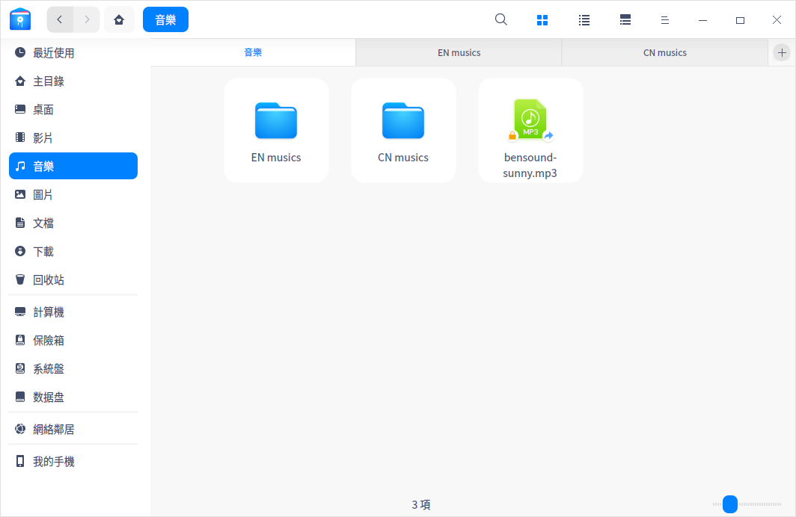

> 竅門：檔案管理員窗口只有一個標籤時，標籤頁是隱藏的，您還可以使用快捷鍵  **Ctrl + T** 來新建標籤頁。

### 書籤管理

為常用文件夾添加書籤，以便從左側導航欄快速訪問。

- 添加書籤：右鍵單擊文件夾，選擇 **添加書籤** 就可以在導航欄創建書籤。
- 移動書籤：在導航欄上下拖動書籤調整書籤排序。
- 刪除書籤：右鍵單擊書籤，選擇 **移除** 來刪除書籤；或右鍵單擊已添加書籤的文件夾，選擇 **移除書籤** 來刪除書籤。

### 標記訊息

通過給文件/文件夾添加標記，可以更好地分類管理您的文件。

> 說明：當前僅x86平台支持 **標記訊息** 功能，該幫助手冊中涉及的標記訊息相關內容僅適用於x86平台。

#### 添加標記

您可以為一個文件（夾）添加多個標記，也可以同時為多個文件（夾）添加標記；添加成功的標記會出現在左側導航欄內。

##### 通過編輯框添加標記

1. 右鍵單擊文件（夾），選擇 **標記訊息**。
2. 輸入標記名稱，若要添加多個標記，可用逗號分隔。
3. 單擊界面空白區域保存設置。

>說明：標記顏色從8種默認顏色中隨機分配。

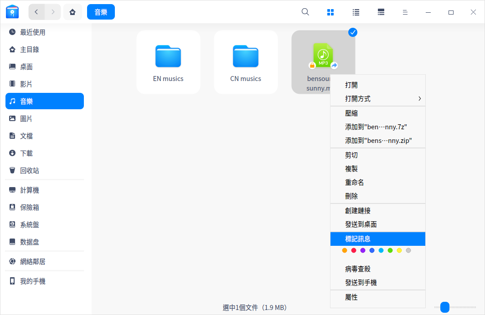

##### 通過顏色按鈕添加標記

右鍵單擊文件（夾），選擇「顏色按鈕」，直接生成這個顏色的標記。

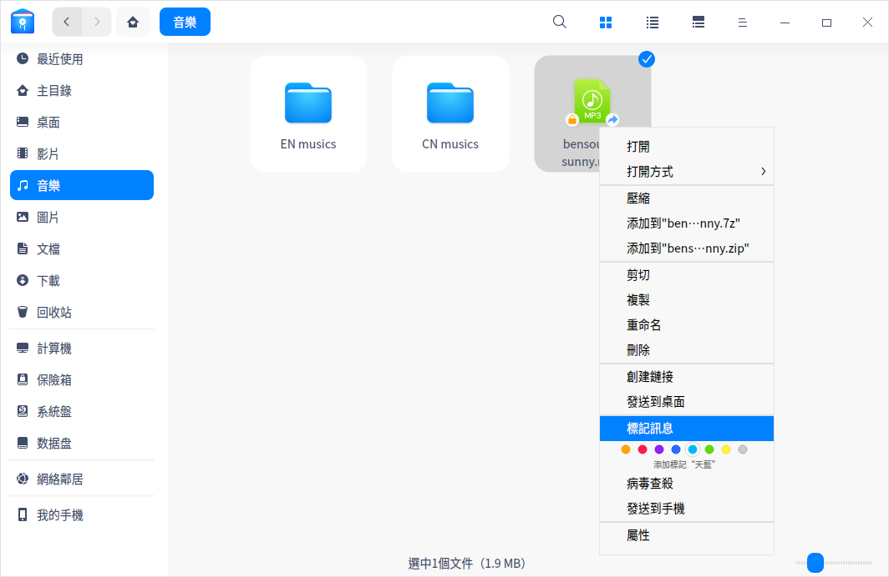

##### 通過右側訊息欄添加標記
選擇文件（夾）後，單擊菜單欄上的圖標 ，在右側訊息欄中也可以添加標記。

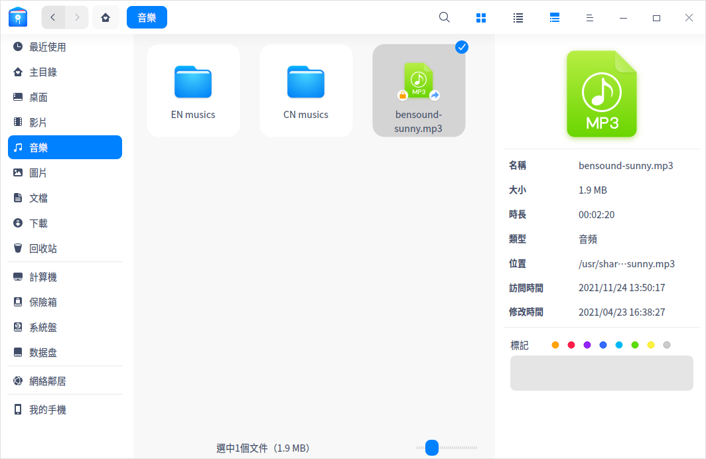

>说明：如果文件有標記，則複製或剪切該文件產生的文件仍然具有同樣的標記。

#### 重命名標記

在左側導航欄中，右鍵單擊某個標記，選擇 **重命名**，修改當前標記的名稱。

#### 修改標記顏色

在左側導航欄中，右鍵單擊某個標記，選擇「顏色按鈕」，即可修改當前標記的顏色。

#### 排序標記

上下拖動標記即可調整標記排序。

#### 刪除標記

右鍵單擊某個標記，選擇 **移除**，刪除當前標記。

### 文件預覽

檔案管理員支持空格鍵預覽功能，選中文件並按下鍵盤上的空格鍵就可以快速預覽文件。預覽窗口可以查看圖片解像度、文檔大小、文本內容等，還支持gif、音頻、影片播放。

#### 預覽影片

1. 選擇您要預覽的影片文件，按下空格鍵，即可開始預覽。
2. 單擊影片任意地方可暫停播放。
3. 播放過程中，可以拖動進度條來快進快退。
4. 單擊底部 **打開** 按扭，在默認程序中打開該影片文件。

> 說明：您也可以同時選擇多個文件，按下空格鍵進行預覽。

### 權限管理
選擇對應文件/文件夾，單擊右鍵，選擇屬性，單擊 **權限管理**， 為所有者，群組，和其他用戶設置文件權限。

### 我的共享

當您設置了共享文件時，「我的共享」會出現在導航欄上。當所有共享文件都取消共享後，「我的共享」自動從導航欄中移除。

#### 共享本地文件

1. 在檔案管理員界面，右鍵單擊文件夾選擇 **共享文件夾**。
2. 在文件夾的屬性窗口中，勾選 **共享此文件夾**。

   > 說明： 如果smb服務未開啟，共享文件夾時會彈出密碼認證窗口，輸入登錄密碼完成認證即可開啟smb服務。

3. 根據需要設置 **共享名**、**權限** 、**匿名訪問** 後關閉窗口。
4. 單擊  > **設置共享密碼**。
5. 輸入共享密碼，單擊 **確定**。

> 竅門：在文件夾的屬性窗口中取消勾選 **共享此文件夾**， 可以取消文件共享；也可以右鍵單擊文件，選擇 **取消共享**。

#### 訪問共享文件

局域網中其他用戶共享的文件一般都可以在網絡鄰居中找到，您也可以通過smb訪問共享文件。

1. 單擊  > **連接到伺服器**，在編輯框中輸入伺服器地址，如：smb://xx.x.xx.xxx（一般為IP位址），單擊 **連接**；或者直接在地址欄中輸入伺服器地址，按下鍵盤上的 **Enter** 鍵。
2. 選擇需要訪問的共享文件夾，在彈出的窗口中輸入用戶名和共享密碼，或者匿名訪問。
   - 未加密的網絡文件可以匿名訪問，不需要輸入用戶名和密碼。
   - 加密的網絡文件需要輸入用戶名和密碼之後才能訪問。

      - 用戶名：共享者登錄系統的用戶名。
      - 密碼：共享文件時設置的共享密碼。
3. 單擊 **連接**。

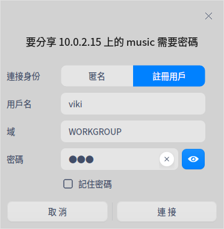 

### 以管理員身份打開

前提條件： 「控制中心」 > 「常規」中 **開發者模式** 已開啟。

1. 在檔案管理員界面，右鍵單擊文件夾。
2. 選擇 **以管理員身份打開**，在彈窗中輸入用戶登錄密碼，單擊 **確定**。
3. 該文件夾會以新窗口打開，在此窗口中可以進行高級權限的操作，關閉窗口後，終止管理員權限。

### 在終端中打開

1. 在檔案管理員空白區域，單擊鼠標右鍵。
2. 選擇 **在終端中打開**，會啟動終端應用程序，終端的路徑為當前目錄。

### 刻錄光盤

您可以通過刻錄功能將音樂、影片、圖片或鏡像文件複製到光盤中。其中，ISO9660文件系統支持所有的CD和DVD光盤格式，UDF文件系統僅支持部分光盤格式。

<table class=block1>
<tr>
   <th align=left>類型</th>
   <th align=left>光盤格式</th>
   <th align=left>ISO9660</th>
   <th align=left>UDF</th>
</tr>
<tr>
   <td rowspan="2">空盤</td>
   <td>DVD-R、DVD+R、CD-R、CD-RW</td>
   <td>支持</td>
   <td>支持</td>
</tr>
<tr>
   <td>非DVD-R、DVD+R、CD-R、CD-RW</td>
   <td>支持</td>
   <td>不支持</td>
</tr>
<tr>
   <td rowspan="2">非空盤</td>
   <td>DVD-R、DVD+R、CD-R、CD-RW</td>
   <td>支持追加文件</td>
   <td>僅支持Windows原生工具刻錄的格式</td>
</tr>
<tr>
   <td>非DVD-R、DVD+R、CD-R、CD-RW</td>
   <td>支持追加文件</td>
   <td>不支持追加文件</td>
</tr>   
</table>

1. 將光盤插入到刻錄機中。
2. 打開檔案管理員，單擊導航欄中的光盤圖標，進入刻錄CD的界面。

3. 右鍵單擊 文件（夾），選擇 **添加至光盤刻錄** 或直接將文件（夾）拖拽到刻錄CD的界面。
4. 在刻錄CD界面，單擊右上角 **刻錄**。

   >說明：如果要從刻錄列表中刪除某個文件（夾），右鍵單擊該文件（夾），選擇 **刪除**，將該文件（夾）從列表中移除。

5. 在彈窗中輸入光盤名稱。您也可以進入 **高級設置** 界面，設置文件系統、寫入速度，或勾選「允許追加數據」、「核驗數據」等，單擊 **刻錄**。

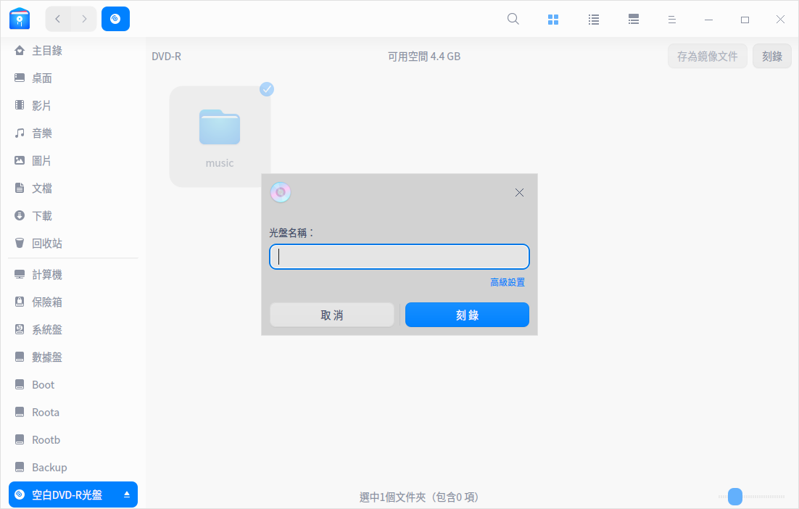

6. 刻錄完成後界面彈出對話框，單擊 **確定**。

>說明：如果需要擦除光盤數據，可以右鍵單擊導航欄中光盤圖標，選擇 **卸載**，再次右鍵單擊該光盤圖標並選擇 **擦除**。

### 創建快捷方式

1. 在檔案管理員界面，右鍵單擊文件（夾）。
2. 選擇 **創建鏈接**。
3. 在彈窗中選擇創建位置、鏈接名稱。
4. 單擊 **保存**，在目標位置會生成該文件(夾)的快捷方式。

> 竅門：選擇 **發送到桌面** 可以直接在桌面上生成該文件（夾）的快捷方式。

### 發送文件（夾）到外接磁盤

當有外接磁盤接入時，您可以將文件或文件夾發送到外接磁盤。

1. 在檔案管理員界面，右鍵單擊文件（夾）。
2. 選擇 **發送到** > 外接磁盤。
3. 文件（夾）將會被發送到移動外接磁盤。

### 發送文件到藍牙

若您的電腦配置了藍牙模塊，便可通過藍牙進行短距離文件傳輸的操作。

前提條件：發送端與接收端藍牙設備已配對並成功連接。具體連接方法請參閱 [連接藍牙設備](dman:///dde#連接藍牙設備)。

1. 在檔案管理員界面，右鍵單擊需要發送的文件或文件壓縮包。
2. 選擇 **發送到** > **發送到藍牙**。
3. 在彈出的藍牙文件傳輸對話框中勾選接收設備，單擊 **下一步**。
4. 此時接收端會收到文件接收的請求，待接收端同意請求後，發送端開始傳輸文件。

## 手機助手

統信UOS助手是一款實現手機與電腦間跨端協作、高效傳輸以及實時同步的工具。將手機與電腦連接或通過無線投送功能，輕鬆實現圖片、影片、文件等的傳輸。

> 說明：僅安卓手機支持安裝統信UOS助手。

### 準備工作

#### 安裝統信UOS助手

1. 單擊左側導航欄 **我的手機** 或系統托盤中的圖標 。
2. 在我的手機界面，單擊 **安裝統信UOS助手**，彈出二維碼窗口。
   - 通過手機微信或瀏覽器掃描二維碼，下載並安裝統信UOS助手。
   - 單擊 **下載APK安裝包**，將安裝包下載到電腦端，下載完成後再導入至手機端進行安裝。
   
   
   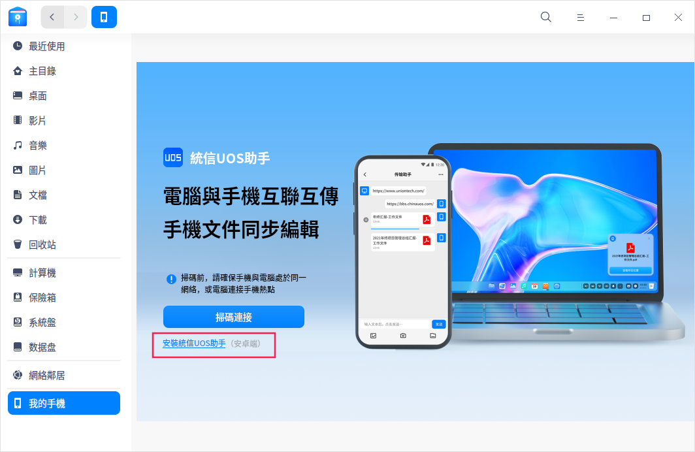

#### 登錄統信UOS助手

統信UOS助手支持手機快捷登錄、微信登錄、帳號密碼登錄這三種登錄方式，可以選擇其中任意一種方式進行登錄。如果您尚未註冊帳號，請在登錄界面單擊 **註冊帳號** 進行註冊。

#### 設置發現方式

通過“發現設置”功能，設置手機和電腦被發現的方式。

在統信UOS助手界面，單擊右上角的 **發現設置**；在電腦系統托盤上，右鍵單擊圖標 ，選擇 **發現設置**，您可以選擇：

- **允許被所有人發現**：在局域網內，允許所有處於同一網絡且在同一網段的設備發現本手機或電腦。
- **僅限同一Union ID帳號發現**：在局域網內，允許登錄同一個Union ID的設備發現本手機或電腦。
- **不被發現**：所有設備都不能發現本手機或電腦。
- **允許被登錄同一Union ID的遠程設備發現**（電腦端）：允許登錄同一個Union ID的遠程設備發現本電腦。

### 連接手機與電腦

登錄統信UOS助手後，您可以通過掃碼連接或搜索電腦的方式將手機與電腦連接起來。

#### 掃碼連接

前提條件：手機與電腦處於同一無線網絡且在同一網段中。

1. 在電腦端，單擊文件管理器左側導航欄 **我的手機** 或系統托盤中的圖標 ，彈出“使用統信UOS助手掃碼連接”的窗口。
2. 在手機端，進入統信UOS助手界面，單擊 **掃碼連接**，掃描步驟1窗口中的二維碼，完成連接。

#### 搜索電腦

前提條件：手機與電腦處於同一無線網絡且在同一網段中（僅支持互發文件，不支持查看和編輯文件）或登錄同一個Union ID帳號；手機與電腦允許被發現。

1. 在統信UOS助手界面，單擊 **搜索電腦**。
2. 在搜索列表中選擇需要連接的電腦，完成連接。

如果需要斷開連接，您可以：

- 在統信UOS助手界面上單擊按鈕  斷開連接。
- 在電腦上右鍵單擊系統托盤中的圖標 ，選擇您的手機，在彈窗中單擊 **斷開連接**。

### 管理文件

手機與電腦連接成功後，您可以發送文件、查看文件和管理文件。

#### 傳輸文件

- **通過統信UOS助手界面進行文件傳輸**

   發送手機文件至電腦：在統信UOS助手界面，單擊 **傳輸助手**，在傳輸窗口中發送文件至電腦端。

- **通過檔案管理員界面進行文件傳輸**

   發送電腦文件至手機：在 **檔案管理員 > 我的手機** 界面，右側傳輸窗口中，您可以選擇電腦文件至該窗口中進行發送；或右鍵單擊電腦中的某個文件，選擇 **發送到我的手機**。

- **通過無線投送功能進行文件傳輸**

   當設備處於同一無線網絡且在同一網段中或已登錄同一Union ID帳號，且設備允許被發現，您可以通過無線投送功能，將文件從一台設備投送到另一台設備中。
   1. 在電腦上右鍵單擊需要投送的文件，選擇 **無線投送**。
   2. 在彈窗中選擇需要投送的手機或電腦，完成投送。

   > 說明：
   >- 手機端需要安裝統信UOS助手並登錄帳號後，才能接收電腦端投送的文件。
   >- 登錄同一Union ID後，可以進行遠程投送的操作。

#### 查看/編輯文件

- 在手機上查看電腦文件：在統信UOS助手界面，單擊 **我的電腦**，您可以打開、下載或分享電腦文件。
- 在電腦上查看/編輯手機文件：在 **檔案管理員 > 我的手機** 界面，分類展示手機相冊、影片、文檔等文件夾，您可以打開、編輯文件夾中的文件，文件經過編輯並保存後將同步至手機端。

## 文件角標

您可以通過命令行，將圖標文件指定給一個文件或文件夾作為角標顯示出來。

>說明：
>- 角標文件支持svg、jpg、png、bmp、gif格式，且大小不超過100KB。
>- USB記憶體及光盤下的文件，不支持添加角標。

### 添加單個角標

1. 在終端輸入命令 **gio set xxx(文件路徑)  -t stringv metadata::emblems "xxx(圖標路徑)"** ，該命令默認在文件（夾）右下角添加角標。

   >注意：系統已定義的特殊角標，不支持被替換。

2. 您也可以在上述命令中加入位置參數，將角標添加在文件（夾）的左上角（lu）、左下角（ld）、右上角（ru）或右下角（rd）。

   例如：在文件（夾）左上角添加角標

   **gio set xxx(文件路徑)  -t stringv metadata::emblems "xxx(圖標路徑);lu"**

### 添加多個角標

在命令行中加入“**|**”符號將角標文件路徑連接起來，為文件（夾）添加2~4個角標。文件（夾）同一個位置不支持疊加角標，僅支持替換。

例如：在文件（夾）四個角都添加角標

**gio set xxx(文件路徑)  -t stringv metadata::emblems "xxx(圖標路徑);lu|xxx(圖標路徑);ld|xxx(圖標路徑);ru|xxx(圖標路徑);rd"**

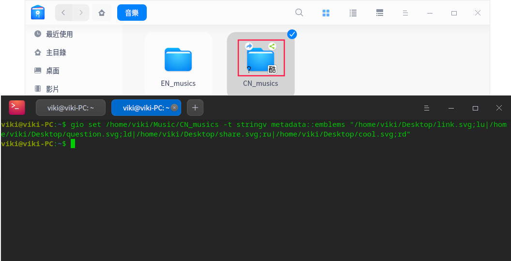

### 撤銷角標

在終端中輸入命令 **gio set xxx(文件路徑) -t stringv metadata::emblems ""** 撤銷文件（夾）上所有的角標。

## 文件保險箱

文件保險箱旨在為您打造專屬的安全空間，為您的私隱保駕護航。

### 設置保險箱密碼

首次使用保險箱需要對其進行密碼設置，具體步驟如下：

1. 單擊導航欄中的保險箱圖標 ，或者在計算機界面雙擊 **我的保險箱**，在彈窗中單擊 **建立**。 
2. 設置解鎖類型、保險箱密碼等，單擊 **下一步**。

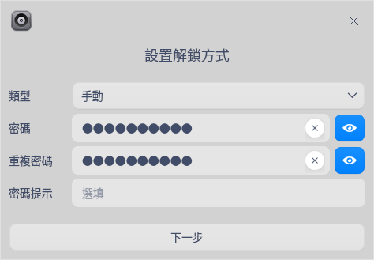

   > 說明: 密碼必須同時包含大寫字母、小寫字母、數字和符號，且字符不小於8位，否則無法進入下一步。

3. 在保存密鑰文件窗口中，設置密鑰文件的存儲位置，單擊 **下一步**。如果您忘記了保險箱密碼，可使用密鑰文件找回密碼。

4. 單擊 **加密保險箱**，彈出認證窗口，輸入用戶登錄密碼後單擊 **確定**。

5. 加密完成後在彈窗中單擊 **確定**，完成保險箱密碼設置。

### 鎖定保險箱

將文件放入保險箱後，右鍵單擊  或者在計算機界面右鍵單擊 **我的保險箱**。
- 選擇 **立即上鎖**，立即將文件保險箱鎖上。
- 選擇 **自動上鎖**，在其下拉選項中：
  + 選擇「從不」，計算機在鎖屏或關機前一直保持未上鎖狀態。
  + 選擇「5分鐘」、「10分鐘」或者「20分鐘」後自動上鎖保險箱。

### 解鎖保險箱

1. 單擊  或者在計算機界面雙擊 **我的保險箱**。
2. 在解鎖保險箱窗口中，輸入保險箱密碼，單擊 **解鎖**。
3. 如果忘記了保險箱密碼，單擊 **忘記密碼**，選擇密鑰文件的存儲位置後，單擊 **驗證密鑰** 找回密碼。

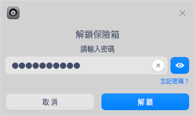

>竅門：您也可以右鍵單擊  或者 **我的保險箱**，選擇 **解鎖**，解鎖保險箱。

### 刪除保險箱

刪除保險箱需要提前解鎖保險箱。
1. 右鍵單擊  或者 **我的保險箱**，選擇 **刪除保險箱**。
2. 彈出刪除保險箱窗口，輸入保險箱密碼，單擊 **刪除**。
3. 在密碼認證窗口中輸入用戶登錄密碼，單擊 **確定** 完成操作。
> 注意：刪除保險箱會將裏面的文件一併刪除。在進行刪除操作前，請將保險箱中的文件備份。

## 磁盤管理

檔案管理員管理本地磁盤和外接磁盤。本地磁盤顯示在檔案管理員的左側導航欄上或計算機界面；掛載外接磁盤或者插入其他移動存儲設備時，也會在導航欄看到相應的磁盤圖標。

<table class=block1>
    <caption></caption>
    <tbody>
        <tr>
            <td>本地磁盤</td>
            <td>本地硬碟分區的所有磁盤</td>
        </tr>
        <tr>
            <td>外接磁盤</td>
            <td>包括移動硬碟、USB記憶體、光盤</td>
        </tr>
    	<tr>
            <td>移動設備</td>
            <td>手機內存、存儲卡、SD卡等</td>
        </tr>
    </tbody>
</table>

> 說明：如果磁盤或磁盤中的文件夾已加密，請輸入密碼後查看文件。

### 本地磁盤

#### 隱藏本地磁盤

1. 在檔案管理員界面，單擊  > **設置**。
2. 在高級設置選項中勾選 **隱藏系統盤**。

#### 重命名本地磁盤

1. 在左側導航欄或計算機界面，右鍵單擊本地磁盤。
2. 選擇 **重命名**。
3. 輸入新名稱，按下鍵盤上的 **Enter** 鍵或單擊界面空白區域保存修改。

> 竅門：在計算機界面，慢速雙擊本地磁盤，呈現編輯框後便可進行重命名操作。

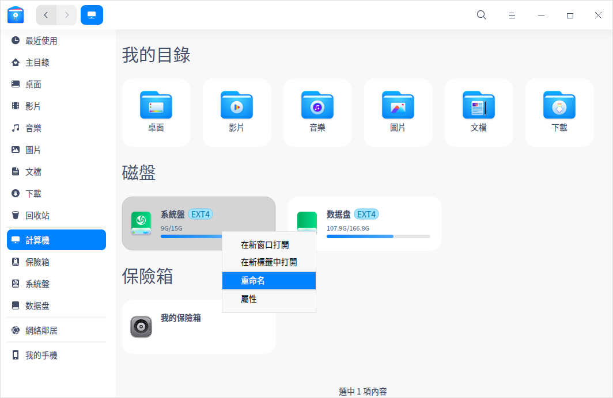

### 外接磁盤

#### 彈出外接磁盤

1. 在左側導航欄或計算機界面，右鍵單擊需要移除的磁盤。
2. 選擇 **安全移除**。
3. 磁盤將從磁盤列表中刪除，一併彈出該磁盤的所有分區。

> 竅門：如果要彈出光盤，請選擇 **彈出** 來移除光盤。單擊導航欄中磁盤右邊的  同樣可以彈出磁盤或光盤。

#### 重命名外接磁盤
1. 在左側導航欄或計算機界面，右鍵單擊需要重命名的磁盤。
2. 選擇 **卸載**後，再次單擊右鍵選擇 **重命名**。
3. 輸入新的卷標名稱，按下鍵盤上的 **Enter** 鍵或單擊界面空白區域保存修改。

#### 格式化外接磁盤

1. 在左側導航欄或計算機界面，右鍵單擊需要格式化的磁盤。
2. 選擇 **卸載** 後，再次單擊右鍵選擇 **格式化**。
3. 設置格式化之後的文件類型和卷標。
4. 單擊 **格式化**。

> 說明：快速格式化速度快，但是數據仍然可能通過工具被恢復，如果想要格式化後的數據無法被恢復，可以取消勾選「快速格式化」，然後執行格式化操作。

## 主菜單

在主菜單中，您可以新建窗口，切換窗口主題，[設置共享密碼](#共享本地文件)，設置檔案管理員，查看幫助手冊和版本介紹。

### 新建窗口

1. 在檔案管理員界面，單擊 。
2. 選擇 **新建窗口**，打開一個新的檔案管理員窗口。

### 連接到伺服器

通過連接伺服器 [訪問局域網共享文件](#訪問共享文件)。

1. 在檔案管理員界面，單擊 。
2. 選擇 **連接到伺服器**，在編輯框中輸入伺服器IP位址。
   - 單擊  按鈕可將該地址添加到「個人收藏伺服器」列表中。
   - 在「個人收藏伺服器」列表中選中一個地址，單擊  按鈕，將該地址從收藏列表中移除。
3. 單擊 **連接**。

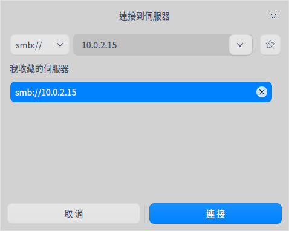

### 設置
#### 基礎設置

1. 在檔案管理員界面，單擊 > **設置** 。
2. 選擇 **基礎設置** 選項。
   + 勾選 **總是在新窗口打開文件夾**。
   + 設置雙擊或單擊打開文件。
   + 設置 **從默認窗口打開**、**從新標籤打開** 哪個目錄。
   + 設置文件圖標 **默認大小** 。
   + 設置 **默認視圖** 以圖標展示或列表展示。
   + 勾選 **顯示隱藏文件**，檔案管理員中被隱藏的文件會顯示出來。
   + 勾選 **重命名時隱藏文件擴展名**，重命名時不會顯示擴展名。
   + 勾選 **顯示最近使用文件**，在左側導航欄顯示最近使用的文件。

#### 高級設置

1. 在檔案管理員界面，單擊 > **設置** 。
2. 選擇 **高級設置** 選項。
   + 勾選 **自動索引內置磁盤**，搜索文件時會搜索內置磁盤中的文件。
   + 勾選 **連接電腦後索引外部存儲設備**，搜索文件時也會搜索外接設備中的文件。
   + 勾選 **全文搜索**，通過文件中的內容來索引。
   + 勾選預覽文件類型。
   + 勾選 **自動掛載**，接入外接磁盤時自動掛載。
   + 勾選 **自動掛載後打開**，接入外接磁盤時自動掛載並打開該磁盤。
   + 勾選 **MTP掛載路徑下顯示文件統計詳情**，MTP設備掛載後，顯示其路徑底部的狀態欄訊息。
   + 勾選 **Samba共享端常駐顯示掛載入口**，遠程掛載鏈接常駐顯示在導航欄中。
   + 勾選 **使用檔案管理員的文件選擇對話框**，選擇文件時打開檔案管理員窗口。
   + 勾選 **開啟普通刪除提示**，刪除文件時彈出提示對話框。
   + 勾選 **隱藏系統盤**，導航欄和計算機界面將不顯示本地磁盤。
   + 勾選 **在磁盤圖標上顯示文件系統標籤**。

### 主題

窗口主題包含淺色主題、深色主題和系統主題。

1. 在檔案管理員界面，單擊 。
2. 選擇 **主題**，選擇一個主題。

### 幫助

查看幫助手冊，進一步了解和使用檔案管理員。

1. 在檔案管理員界面，單擊 。
2. 選擇 **幫助**。
3. 查看檔案管理員的幫助手冊。

### 關於

1. 在檔案管理員界面，單擊 。
2. 選擇 **關於**。
3. 查看檔案管理員的版本和介紹。

### 退出

1. 在檔案管理員界面，單擊 。
2. 選擇 **退出**。
