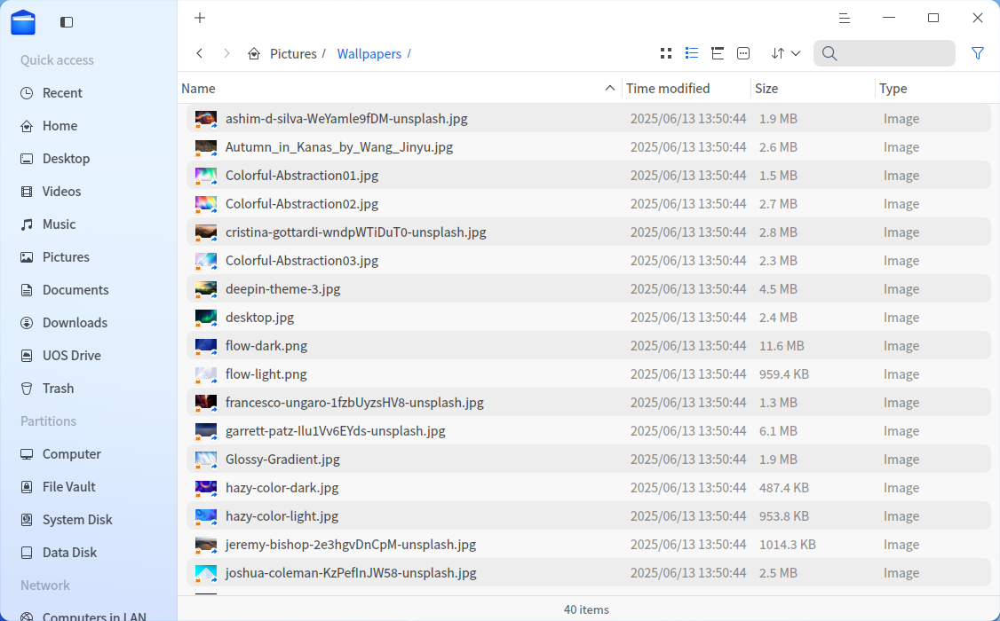
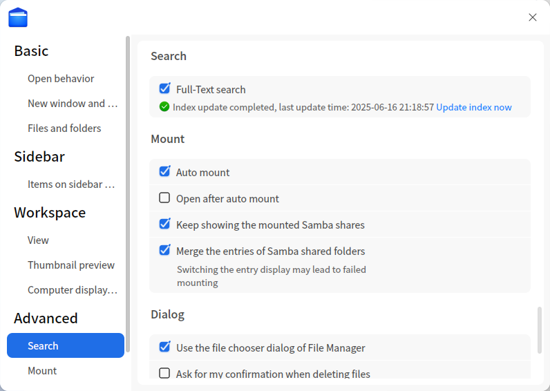
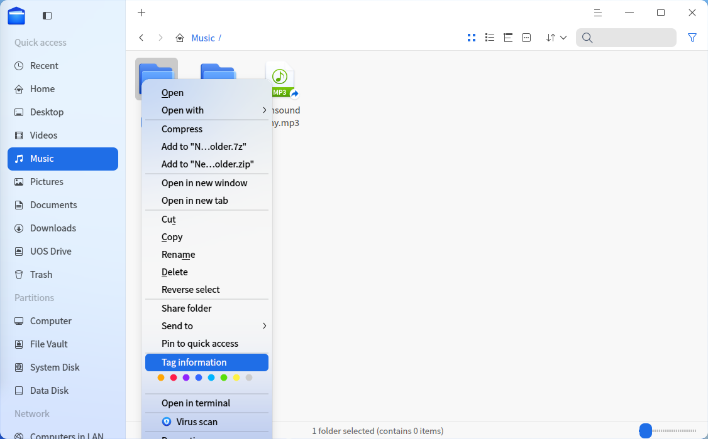
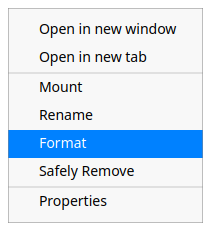

# File Manager|dde-file-manager|

## Overview

File Manager is a powerful, simple and easy-to-use file management tool. It follows the classic function and layout of traditional file manager, and simplifies the user operation and adds many features. The open-and-shut navigation bar, the search box with intelligent identification, a variety of views and sorting let you manage files easily. It's beyond classic, just to give you a better experience!

## Guide

You can run, close and create a shortcut for File Manager by the following ways.

### Run File Manager

1. Click  on dock to enter Launcher interface.

2. Locate  by scrolling mouse wheel or searching by "File Manager" in Launcher interface.

3. Right-click , you can
   
   - Click **Send to desktop** to create a desktop shortcut.
   - Click **Send to dock** to fix the application on dock.
   - Click **Add to startup** to add the application to startup, it will automatically run when the system starts up.
   
   >  Tips: You can also press **Super** + **E** to start File Manager.

### Exit File Manager

- On File Manager interface, click  to exit.
- Right-click  on Dock, select **Close All** to exit File Manager.
- Click  and select **Exit** to exit File Manager.

### View Shortcut Keys

On Document Viewer interface, press **Ctrl + Shift + /** to view all shortcut keys quickly, which helps you to use them skillfully and improves your working efficiency. 

## Main Interface

The main interface of the file manager is simple, user-friendly, and feature-rich. Mastering its functions will make file management simpler and more efficient.

| No.  | Name           | Description                                                  |
| ---- | -------------- | ------------------------------------------------------------ |
| 1    | Navigation Bar | Click navigation icons to quickly access local files, disks, network neighbors, bookmarks, tags, etc. |
| 2    | Tab Bar        | Create, remove, or reorder tabs in the tab bar.              |
| 3    | Address Bar    | Quickly switch browsing history, navigate between parent/child directories, or enter a path. |
| 4    | View & Options | Click , ,  to switch between icon, list, or tree list views. Click  to adjust icon size, grid density, or enable previews. |
| 5    | Sorting        | Click  to change sorting criteria. |
| 6    | Search         | Search for files in the current directory.                   |
| 7    | Menu Bar       | Create new windows, switch themes, set sharing passwords, configure settings, view help/about, or exit. |
| 8    | Status Bar     | Displays total files or selected file count.                 |

> Tip: Drag the divider on the right side of the left navigation bar to adjust its width.

---

## Basic Functions

File Manager is featured with the basic functions as a file manager, you can easily create, copy, rename or delete files/folders with it.

### New Document/Folder

#### New Document

1. On File Manager interface, right-click and select **New document**.
2. In the pop-up menu, select the document format you want to create.
3. Input a name for the new document, and press **Enter**, or click at blank area.

#### New Folder

1. On File Manager interface, right-click and select **New folder**.
2. Input a name for the new folder, and press **Enter**, or click at blank area.

### Rename File/Folder

1. Select the file/folder, right-click to select **Rename**.
2. Input a new name for the file/folder, and press **Enter**, or click at any blank area.

>  Tips: Check "Hide file extension when rename" in **Settings** to rename file more conveniently.

### Batch Rename

1. On File Manager interface, select multiple files.
2. Right-click and select **Rename**.
   - **Replace Text**: Input the content to be replaced in Find box, and input content to rename in Replace box.
   - **Add Text**: Input the content to add in Add box, and select the location.
   - **Custom Text**: Input the file name and SN.
3. Click **Rename** to finish operation.

### View Files

Click menu bar icons , ,  or use shortcuts **Ctrl + 1**, **Ctrl + 2**, **Ctrl + 3** to switch views.

- **Icon View**: Displays file names and icons/thumbnails in tiles.  
  

- **List View**: Shows file icons/thumbnails, names, modification times, sizes, and types in a list.  
  

- **Tree List View**: Expands directories hierarchically with file details.  
  

Click  to adjust view styles:

- Icon View: Customize icon size and grid density.  
  
- List/Tree View: Adjust row height.  
  

>  Tips:
> 
> - In list view, place the cursor on the dividing line between any two columns and drag it to change the width of the current column. Double-click the dividing line to adjust to the biggest width of the current column automatically. 
> - Press  **Ctrl**+**1**  or  **Ctrl**+ **2**  to switch icon view and list view. 

### Sorting

1. Right-click in the file manager or click  in the title bar.
2. Select **Sort by** > *Name*, *Modified*, *Created*, *Size*, or *Type*.

Enable **Mix files and folders** in **Main Menu > Settings > Basic Settings > Files and Directories** to sort them together.

>  Tips: you can click the head of the columns in the list view to change the sort order.

### Open Files

1. On File Manager, right-click the file you want to open.
2. In the context menu, select **Open with**>**Select default program**.
3. Select the application you want to open the file in the list.

>  Notes: It will use the default application to open the file when you double-click it. You can right-click multiple files of the same type, and select **Open with** to open them at a time.

### Hide Files

1. On File Manager, right-click the file you want to hide.
2. Select **Properties**, check **Hide this file**.

### Copy File/Folder

1. Select the files/folders to be copied, right-click and select **Copy**.
2. Enter the directory to which the files/folders will be pasted, right-click and select **Paste**.

### Compress File/Folder

1. Select the files/folders to be compressed, right-click and select **Compress**.
2. Compress interface of Archive Manager pops up. Set the format, name, storage location and so on, click **Compress**.

>  Tips: you can also select **Add to xxx.7z** or **Add to xxx.zip** in the context menu to compress file (folders) quick.

### Delete File/Folder

1. Right-click the file/folder in the interface of File Manager.

2. Select **Delete**. 
   
   - You can find the deleted files in Trash. Right-click files in Trash, you can choose **Restore** or **Delete**. File/folder in external device will be permanently deleted and can not be restored when you select **Delete**.
   - The shortcut of the deleted files will become invalid.

>  Notes: You can check **Ask for my confirmation when deleting files** in **Main Menu > Settings > Advanced**, and a prompt box to confirm deletion will pop up each time you delete a file.

### Undo Operation

In file manager,  use **Ctrl + Z** to undo the previous steps, including:

- Delete the newly created file/folder.
- Resume the renamed file/folder to the previous name.
- Restore the deleted file/folder from trash.
- Restore the moved (via dragging or cutting) file/folder to the previous location.
- Delete the copied and pasted file/folder.

>  Attention: It can undo two continuous steps at most. If there is file overwriting or permanently file deleting, then you can only return to that step.

### File/Folder Properties

In Properties of files, you can view the basic info, open with list, and permissions. In properties of folders, you can see basic info, sharing info, and permissions.

1. On File Manager interface, right-click a file. 
2. Select **Properties**.

>  Notes: If you check the properties of multiple files at a time, the total size and quantities will be displayed. If you check the properties of a shortcut, the source file location will be displayed in addition. You can use shortcuts **Ctrl + I** to view the properties as well.

## Common Operations

File Manager is featured with many useful functions, which are all designed to ease the commonly used operations.

### Switch Address Bar

The address bar combines history navigation, breadcrumbs, and a path input field. By default, it shows breadcrumbs.

- **History Navigation**: Use arrows to browse forward/backward.

- **Breadcrumbs**: Click any level to jump directly. Hover and click ▼ to see full path hierarchy.  

  

- **Path Input**: Click the blank area to enter/edit a path. Click outside to revert to breadcrumbs.  

  

### Search Files

Press **Ctrl + F** or click the search icon in the address bar to search.  

Search supports basic (name/content) and advanced filters (type/size/time).

- Search within a directory by navigating there first.
- Use spaces to separate multiple keywords.

>  Note: Enable **Auto-index internal disks** in settings. Check **Index external devices after connection** to speed up external searches.

#### Full-Text Search

Search by file content keywords.  

To enable:

1. Go to  > **Settings**.
2. Check **Full-text search** under *Advanced Settings > Search*.  

#### Advanced Search

Click  after entering keywords to narrow results by:  

- Scope
- File Size
- File Type
- Modification/Access/Creation Time  

### Recent Files

By default, there is a **Recent** entry on left panel. Click it to view the recently used files. Files are sorted by default in reverse order of access time.

>  Notes: If you want to hide "Recent", you can uncheck "Display recent file entry in left panel" in Settings > Basic > Hidden files. To hide the access record of a specific file, right-click the file and select **Remove** which will not delete the file.

### Manage Tabs

- Click **+** in the tab bar to open a new tab.
- Click **×** or middle-click a tab to close it.  

**Open folders in new tabs**:

1. Right-click a folder.
2. Select **Open in new tab**.  

### Manage Bookmarks

To quickly visit a folder from the left panel, you can add bookmarks for frequently used folders.

- Add Bookmarks: right-click a folder, select **Pin to quick access** to create a bookmark in the navigation bar.

- Move Bookmarks: you can move bookmarks within the bookmark area. Drag and drop the bookmark to the designated location.

- Delete Bookmarks: right-click the bookmark, select **Remove from quick access** to delete the bookmark.

### Manage Tags

By adding tags on file/folder, you can classify and manage your files better.

>  Notes: currently only x86 platform supports **Tag information**. 

#### Add Tags

You can add tag to multiple files/folders at a time, or add multiple tags to a single file/folder. The tag appears in the left panel.

##### By Tag Information

1. Right-click a file/folder, select **Tag information**.
2. Input tag name. Use comma to separate tags in case of multiple tags.
3. Click any blank area to finish adding tag.

>  Notes: The tag color is randomly assigned from eight default colors.

##### By Color Tag

Right-click a file/folder, select a "color button" to create a color tag directly.

##### By information column on the right side

Select a file/folder, click , and add tags in the information column on the right side.

>  Notes: If a file has a tag, copy or cut and then paste it, the new file still has the same tag.

#### Rename Tag

Right-click a tag in  the left panel,  select **Rename** to modify the current tag.

#### Change Tag Color

Right-click a tag in  the left panel,  select a "Color button" to change the current tag color.

#### Change Tag Order

Drag and drop the tag upwards or downwards to change its order.

#### Delete Tag

Right-click a tag in left panel,  select **Remove** to delete the tag.

### Preview Files

File Manager supports file preview by pressing space bar. Select a file and press the space bar on the keyboard to quickly preview it. In the preview window, you can view the file info, including image resolution, document size, text content. It also supports gif format, audio and video playback.

#### Preview Video

1. Select a video and press the space bar to start video preview.
2. Click in the preview window to pause video playing.
3. Drag the progress bar to play forward or backward.
4. Click **Open** at the bottom to open the video by default program.

>  Notes: You can select multiple files and press space bar to preview them at a time.

### Permission Management

In file/folder properties, click **Permissions** to set **Owner**, **Group** and **Others**. 

### My Shares

When you set up a shared file, "My Shares" appears on the left panel. 

#### Share Local Files

Sharing local files is convenient for other users in the LAN to view, edit or download files to improve efficiency.

To share files, you need to start smb service. When you use the file sharing function for the first time, the system will pop up the "Start smb service authentication" window, enter the login password to complete the authentication to start smb service.

1. On File Manager interface, right-click a folder, select **Share folder**.
2. In the properties window, check **Share this folder**.
3. Set up **Share name**, **Permission**, and **Anonymous**.
4. Click **Set password**.
5. enter the password and click **Confirm** in the "Enter a password to protect shared folders" window .

If you have set the share password, the interface will display **Change password**, click it to change password, or click  > **Set share password**

>  Tips: Click the copy button  to the right of the network path and username to copy the access path and username to the clipboard so you can share the information with your visitors.

#### Visit Shared Folders

Users on the LAN can access the shared files through the network path provided by the sharer.

1. Visit shared folders by one of the following methods.
   
   - Input the server address, e.g. smb://10.0.2.15 directly in the address bar and press **Enter**.
   - Click  > **Connect to Server** and input the server address, and click **Connect**.

2. Select the shared folder you need to visit, and the "Password required for share XX on 10.0.2.15" window will pop up.
   
   - If the folder is set to not allow anonymous access, enter the system user name and share password of the sharer in the "Registered Users" tab.
   - If the folder is set to allow anonymous access, you can select the "Anonymous" tab and visit the shared folder without entering a username and password.

3. Select to remember password or not and click **Connect**.

#### Cancel Sharing

When all shared files are cancelled, "My Shares" is removed from the left panel, and you can cancel local shared files in one of the following ways. 

- Right-click the shared folder and select **Cancel sharing**.
- Right-click the shared folder and select **Properties**, uncheck **Share this folder** in the "sharing" part of the properties window.

### Open as Admin

Prerequisite: Please enable **Developer Mode** from Control Center > General Settings.

1. Right-click in the blank area on File Manager. 
2. Select **Open as admin**, input your login password in the pop-up window and click **Confirm**.
3. The file will be opened in a new window, in which you can operate with admin permissions. And you will exit admin permissions when you close this window.

### Open in Terminal

1. Right-click in the blank area on File Manager. 
2. Select **Open in terminal**, Terminal will be opened, and its directory will be the current one.

### Burn CD

You can copy music, video, pictures, or mirror files to a CD or DVD through the burning feature. Please prepare a CD or DVD disc and a device with recording function in order to perform the following operations. The ISO9660 file system supports all CD and DVD formats, while the UDF file system only supports some CD formats. 

<table class="block1">
<tr>
<td>Type</td>
<td>Format</td>
<td>ISO9660</td>
<td>UDF</td></tr>
<tr>
<td rowspan="2">Blank disks</td>
<td>DVD-R, DVD+R, CD-R, CD-RW</td>
<td>Supported</td>
<td>Supported</td></tr>
<tr>
<td>Non DVD-R, DVD+R, CD-R, CD-RW</td>
<td>Supported</td>
<td>Not Supported</td></tr>
<tr>
<td rowspan="2">Non blank disks</td>
<td>DVD-R, DVD+R, CD-R, CD-RW</td>
<td>Adding files afterwards is supported.</td>
<td>Only formats burned by primitive tools of Windows are supported.</td></tr>
<tr>
<!--<td>4.1</td>-->
<td>Non DVD-R, DVD+R, CD-R, CD-RW</td>
<td>Adding files afterwards is supported.</td>
<td>Adding files afterwards is not supported</td></tr>   
</table>

#### Duplicate Local Files

1. Open File Manager and click the CD Icon in the left panel to enter the burning interface.

2. Right click the file (folder) and select **Add to disc** or drag the file (folder) directly to the burning interface.

3. In the burning interface, click **Burn** in the upper right corner.

4. A window pops up. Input the disc name. You can also enter the **Advanced settings** interface, set the file system and write speed, or check "Allow files to be added later", "Verify data" and so on, and click **Burn**.

5. After burning, a prompt box will pop up in the interface, and click **OK**.

#### Erase

1. Open File Manager and click the CD Icon in the left panel to enter the burning interface.
2. Select **Unmount**, right-click the disc icon again and select **Erase**.
3. Click **Erase** in the pop-up prompt box.

#### Save as Image File

1. Open File Manager and click the CD Icon in the left panel to enter the CD interface.

2. Click **Save as Image File** in the top right corner.

3. In the pop-up window, select a save path, and click **Create ISO Image** to save files as an ISO image file.

### Create Link

1. On File Manager interface, right-click the item to create a link for.
2. Select **Create link**.
3. In the pop-up window, select a location and input the name of the link.
4. Click **Save** to finish creating the link.

>  Tips: By selecting **Send to desktop** for an item, you can create a link on desktop with one click.

### Send To Other Devices

When there is an external device inserted, you can directly send file/folder to it.

1. On File Manager interface, select a file/folder.
2. Right-click and select **Send to**.
3. Select the device you want to send to.
4. File/folder will be copied to the device.

### Send to Bluetooth

If your computer is equipped with Bluetooth module, you can transfer files in short distance through Bluetooth.

Prerequisite: The Bluetooth devices of sender and receiver have been paired and connected successfully. Refer to [Connect to a Bluetooth Device](dman:///dde#Connect to a Bluetooth Device) for details.

1. On File Manager interface, right-click the file or package to be sent.
2. Select **Send to** > **Send to Bluetooth**.
3. Select the receiver in the pop-up window, and click **Next**.  
4. A file receiving request will pop up on the receiving device. After the receiver agrees the request, the sender starts to transfer the file.
   

## Add Corner Marker to Files/Folders

You can assign an icon file to a file or folder icon through the command line and display it as a corner marker.

>  Notes: 
> 
> - The corner marker files support formats such as svg, jpg, png, bmp, and gif, but not bigger than 100KB.
> - The corner marker could not be added to files in USB disks and CD-ROM disks.

### Add a Single Corner Marker

1. Open Terminal, input **gio set xxx(file path)  -t stringv metadata::emblems "xxx(icon path)"**, which means to add a corner marker in the lower right corner of the file/folder icon by default.

>  Attention: the special corner markers defined by the system could not be replaced.

2. You can add position codes into the above command to add a corner marker to the upper left corner(lu), lower left corner(ld), upper right corner(ru) or lower right corner(rd).
   For example, to add a corner marker to the upper left corner, you have to input:
   **gio set xxx(file path)  -t stringv metadata::emblems "xxx(icon path);lu"**

### Add Multiple Corner Markers

To add 2~4 corner markers to a file/folder, you can input "|" in the command to separate multiple paths of the corner marker files. Only one corner marker can be added to the same corner, but you can replace it.

For example, to add 4 corner markers to a file/folder icon, you can input:
**gio set xxx(file path)  -t stringv metadata::emblems "xxx(icon path);lu|xxx(icon path);ld|xxx(icon path);ru|xxx(icon path);rd"**

### Cancel Corner Markers

Open Terminal, input **gio set xxx(file path) -t stringv metadata::emblems ""** to cancel all corner markers on the file/folder icon. 

## Disk Management

On File Manager interface, you can manage local and external disks. 

Local disks are displayed in the left panel of File Manager. When you mount any external disks or insert other mobile storage devices, the corresponding icons will be displayed in the left panel.

<table class="block1">
    <caption></caption>
    <tbody>
        <tr>
            <td>Local disks</td>
            <td>All disks of local harddisk divisions</td>
        </tr>
        <tr>
            <td>External disks</td>
            <td>Including mobile hard disks, CDs/DVDs and USB flash disks.</td>
        </tr>
        <tr>
            <td>Mobile devices</td>
            <td>Including mobile phone storage, storage cards, SD cards and so on.</td>
        </tr>
    </tbody>
</table>

>  Notes: If disks or folders in the disk are encrypted, you will have to input password before visiting them. 

### Local Disks

#### Hide Built-in Disks

1. Click > **Settings** on the interface of File Manager.
2. In the **Advanced**, check **Hide built-in disks on the Computer page**. Uncheck **Built-in disks** in **Advanced> Items on sidebar pane**.

#### Rename Local Disks

1. Right-click a local disk in the left panel or in the computer interface.
2. Select **Rename**.
3. Input the new name and press **Enter** or click any blank area to save the modification.

>  Tips: In the computer interface, double click any local disk slowly, after the editing box appears, you can rename it directly.

### External Disks

#### Eject External Disks

1. In the left panel of File Manager, right-click the disk you want to remove.

2. Select **Safely Remove**.

3. The disk will be removed from the disk list, and so will all partition of it .

>  Tips: you can also select **Eject** or click  in the left panel to unmount the disk.

#### Rename External Disks

1. In the left panel or on computer interface, right-click the disk you want to rename.
2. Select **Unmount** and then select **Rename**.
3. Input the new name and press **Enter** or click any blank area to save the modification.

#### Format External Disks

1. In the left panel of File Manager, right-click the disk to format.
2. Select **Unmount** and then select **Format**.
3. In the pop-up window, choose the type and volume label for the disk.
4. Click **Format**.

>  Notes: If you check **Quick Format**, the disk can be formatted quickly in a few seconds, but the data could be restored by file recovery tools. If you don't want these data to be restored, you can uncheck this option box and format the disk.

## Main Menu

You can create new window, switch themes, connect to server, set share password (see [Share Local Files](#Share Local Files)), make settings, view manual and version information in Main Menu.

### New Window

1. Click on the interface.
2. Select **New window** to open a new window of File Manager.

### Connect to Server

You can [visit sharing folders](#Visit Sharing Folders) by connecting to server.

1. Click  > **Connect to Server** on the interface.
2. "Connect to Server" window pops up. Select a connection protocol from the drop-down box and input server's IP address (XX.XX.XX.XX) in the address bar.

>  Tips: You can click  to add frequently used server addresses to "My favorites".

3. Click **Connect**.

### Settings

Click > **Settings** on the interface of File Manager to set up basic and advanced settings.

#### Basic

- **Open Behavior**: Choose to open folders in new windows/double-click/single-click files.
- **New Windows/Tabs**: Set default actions for opening directories.
- **Files & Directories**: Toggle *Show hidden files*, *Show extensions*, or *Mix files/folders in sorting*.  

#### Sidebar

- **Display Items**: Customize visibility of shortcuts, partitions, network, and tags.

#### Workspace

- **View**: Set default icon size, view mode, and sorting.
- **Thumbnail Preview**: Configure file types for previews.
- **Computer Items**: Choose displayed partitions/tags.

#### Advanced Settings

- **Search**: Enable full-text search and manually update indexes.
- **Mount**: Auto-mount external disks, open after mounting, or display Samba entries.
- **Dialogs**: Use file manager for file selection dialogs or enable delete confirmations.
- **File Sharing**: Configure sharing permissions and save locations.

### Theme

The window theme includes Light Theme, Dark Theme and System Theme.

1. Click on the interface.
2. Click **Theme** to select one.
   
   

### Help

1. Click on the interface.
2. Click **Help** to view the manual.
   
   

### About

1. Click on the interface.
2. Click **About** to view version information and introduction about File Manager.
   
   

### Exit

1. Click on the interface.
2. Click **Exit**.
