# 檔案管理器|dde-file-manager|

## 概述

檔案管理器是一款功能強大、簡單易用的文件管理工具。它沿用了傳統檔案管理器的經典功能和布局，並在此基礎上簡化了使用者操作，增加了很多特色功能。一目了然的導航欄、智慧識別的搜尋框、多樣化的檢視及排序讓您管理起來得心應手，經典和超越，只為給您更好的體驗！

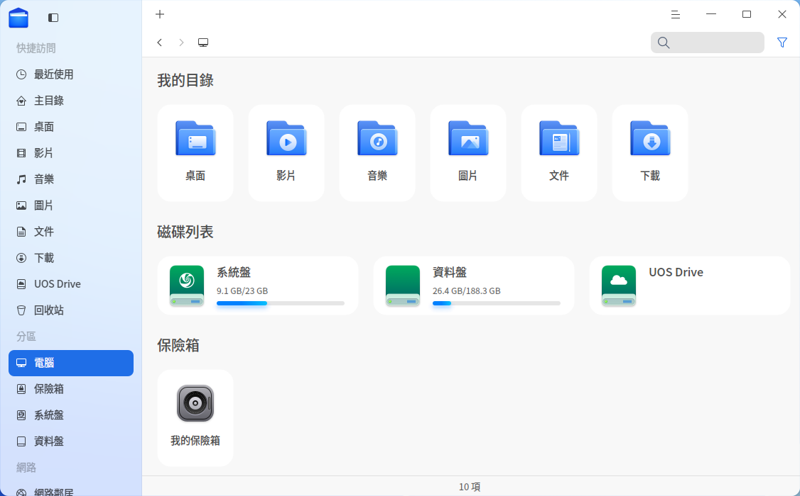

## 使用入門

透過以下方式執行或關閉檔案管理器，或者建立檔案管理器的捷徑。

### 執行檔案管理器

1. 單擊桌面底部的 ，進入啟動器介面。
2. 上下滾動滑鼠滾輪瀏覽或透過搜尋找到檔案管理器，單擊執行。
3. 右鍵單擊 ，您可以：
   - 單擊 **建立桌面捷徑**，在桌面建立捷徑。
   - 單擊 **釘選到Dock**，將應用程式固定到Dock。
   - 單擊 **開機啟動**，將應用程式添加到開機啟動項，在電腦開機時自動執行該應用。

>  竅門：您可以使用組合鍵 **Super + E** 啟動檔案管理器。

### 關閉檔案管理器

- 在檔案管理器介面，單擊  ，關閉檔案管理器。
- 在任務欄右鍵單擊 ，選擇 **全部關閉** 來關閉檔案管理器。
- 在檔案管理器介面，單擊 ，選擇 **退出** 來關閉檔案管理器。

### 查看快捷鍵

在檔案管理器介面上，按下**Ctrl + Shift + /**  組合鍵來查看快捷鍵，熟練的使用快捷鍵，將大大提升您的操作效率。

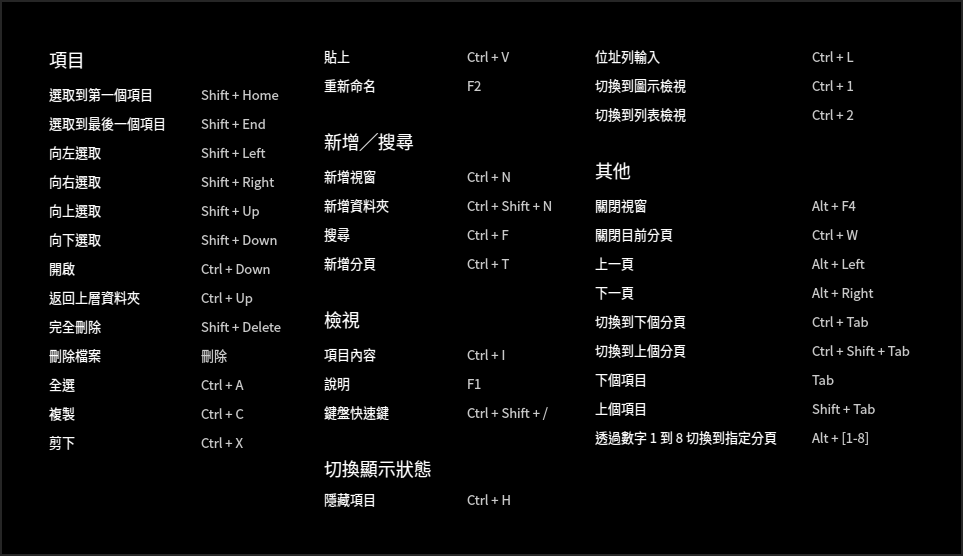

## 主介面

檔案管理器的主介面簡單易用、功能全面，熟練地使用介面功能將使文件管理更加簡單高效。

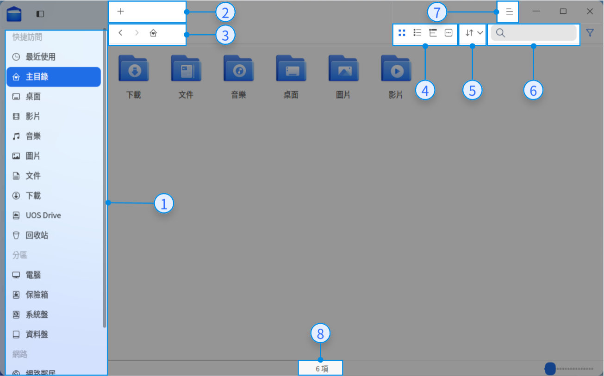

| 編號 | 名稱       | 描述                                                         |
| ---- | ---------- | ------------------------------------------------------------ |
| 1    | 導覽列     | 點選圖示快速存取本機檔案、磁碟、網路上的芳鄰、書籤、標籤等。 |
| 2    | 分頁列     | 新增、移除分頁或調整分頁順序。                               |
| 3    | 網址列     | 切換瀏覽紀錄、上下層目錄導覽或輸入路徑。                     |
| 4    | 檢視與選項 | 點選  切換圖示、清單、樹狀清單檢視。點選  調整圖示尺寸、網格密度或預覽設定。 |
| 5    | 排序       | 點選  變更排序方式。               |
| 6    | 搜尋       | 搜尋目前目錄的檔案。                                         |
| 7    | 功能表列   | 新增視窗、切換佈景主題、設定分享密碼、設定選項、檢視說明或結束程式。 |
| 8    | 狀態列     | 顯示檔案總數或已選取數量。                                   |

> 秘訣：拖曳左側導覽列右側分隔線調整寬度。

## 基本功能

檔案管理器具備基本的文件管理功能，對文件(夾)進行新增、複製、重新命名、刪除等操作都非常簡單。

### 新增文件

#### 新增文件

1. 在檔案管理器介面上，單擊滑鼠右鍵。
2. 單擊 **新增文件**。
3. 選擇新增文件的類型。
4. 輸入新增文件的名稱。

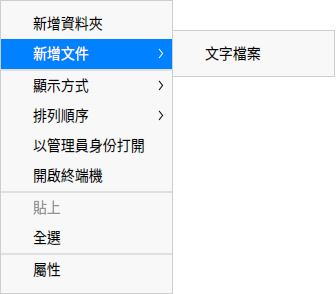

#### 新增資料夾

1. 在檔案管理器介面上，單擊滑鼠右鍵。
2. 單擊 **新增資料夾**。
3. 輸入資料夾的名稱。

### 重新命名文件

1. 在檔案管理器介面上，右鍵單擊文件。
2. 選擇 **重新命名**。
3. 輸入文件名稱，按 **Enter** 鍵或者滑鼠單擊介面空白區域。
   
   

>  竅門：在 **設定** 中勾選「重新命名時隱藏文件副檔名」，能更方便地修改文件名稱。

### 批次重新命名

1. 在檔案管理器介面上，選中多個文件。
2. 右擊文件，並選擇 **重新命名**。
   - **取代文件**尋找需要取代的文字，並輸入取代後的文字，文件名中的關鍵字將被統一取代。
   - **加入文件** 輸入需要加入的文字，並選擇目錄是檔名之前還是之後，文件名將統一加入被添加的文字。
   - **自訂文件** 輸入文件名，並輸入序列的遞進數字，文件名將統一改成新文件名+遞進數字。
3. 單擊 **重新命名** 來完成操作。

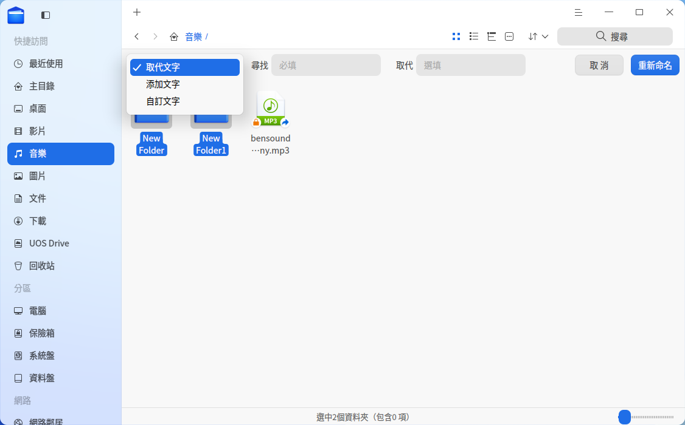

### 查看文件

點選功能表列圖示   或使用快速鍵 **Ctrl + 1  Ctrl + 2**  **Ctrl + 3** 切換檢視模式。

- **圖示檢視**：以圖示/縮圖並排顯示檔案名稱。  

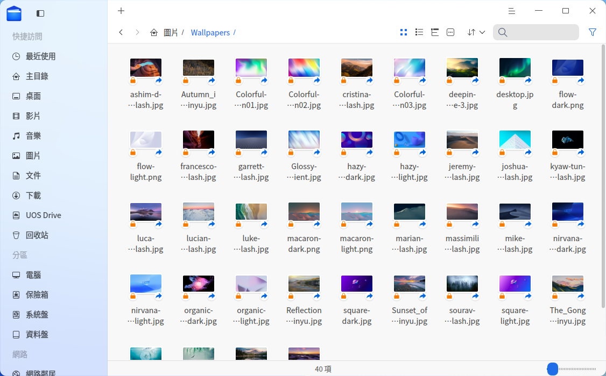

- **清單檢視**：顯示檔案圖示/縮圖、名稱、修改時間、大小及類型。  

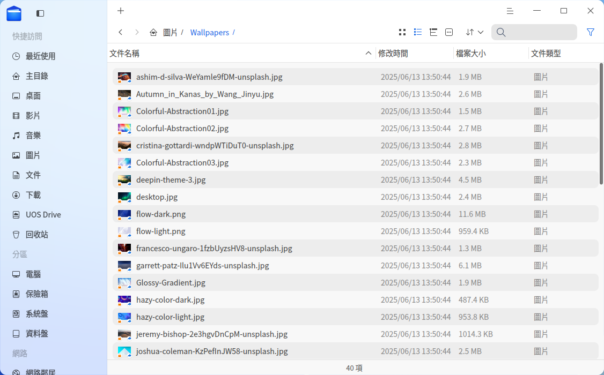

- **樹狀清單檢視**：階層式展開目錄並顯示檔案詳細資料。  

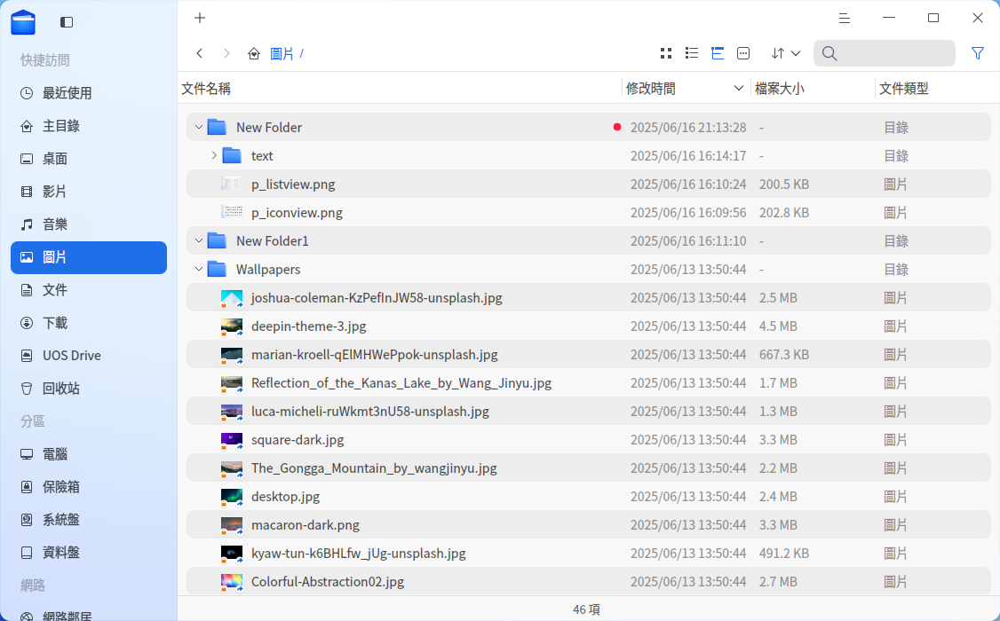

點選  調整檢視：

- 圖示檢視：自訂圖示尺寸與網格密度。  

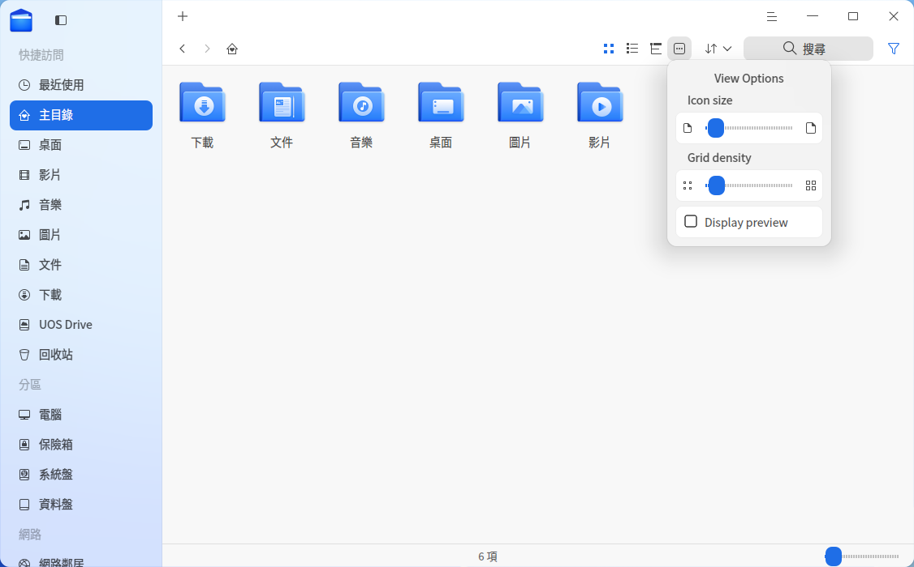

- 清單/樹狀檢視：調整列高。  

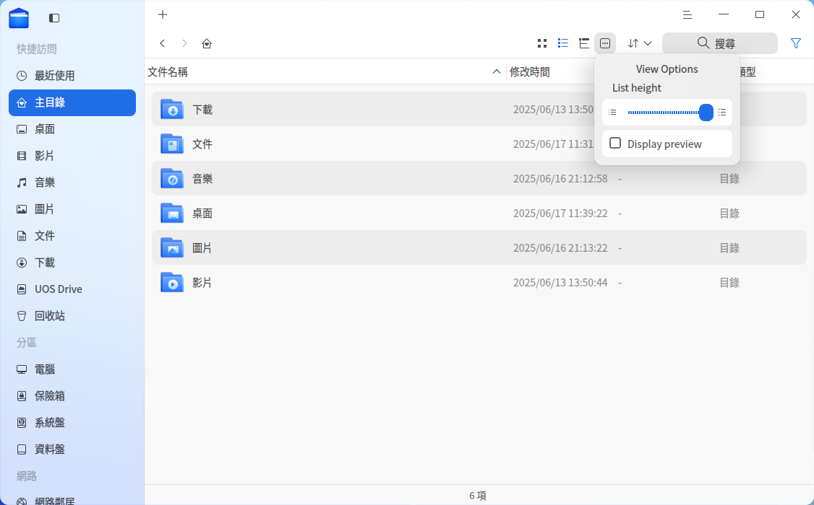

>  竅門：在列表視圖中，把游標置於兩列之間的分隔線上，拖動它來改變列的寬度；雙擊分隔線可將當前列自動調整為本列內容最寬的寬度。
> 

### 排序文件

1. 在檔案管理員按右鍵或點選標題列。
2. 選擇 **排序方式** > *名稱*、*修改時間*、*建立時間*、*大小* 或 *類型*。

於 **主功能表 > 設定 > 基本設定 > 檔案與目錄** 勾選 **檔案和資料夾混合排序** 可合併排序。

> 秘訣：清單檢視中點選欄位標題切換升冪/降冪排序。

### 打開文件

1. 在檔案管理器介面上，右鍵單擊文件。
2. 選擇 **用其他程式打開** > **選擇預設打開程式**。
3. 在程式列表中選擇應用程式。

>  說明：直接雙擊文件會使用預設程式打開。您可以選擇相同類型的多個文件，右鍵選擇「用其他程式打開」選項，一次打開多個文件。

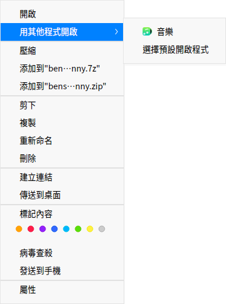

### 隱藏文件

1. 在檔案管理器介面上，右鍵單擊文件。
2. 選擇 **屬性**，勾選 **隱藏此文件**。

### 複製文件

1. 在檔案管理器介面上，右鍵單擊文件。
2. 單擊 **複製**。
3. 選擇一個目標儲存位置。
4. 單擊滑鼠右鍵，然後選擇 **貼上**。

### 壓縮文件

1. 在檔案管理器介面，右鍵單擊文件（夾）。
2. 選擇 **壓縮**。
3. 彈出歸檔管理器壓縮介面，可以設定壓縮包格式、名稱、儲存路徑等，單擊 **壓縮**。

>  竅門：您也可以直接在右鍵選單中選擇 **添加到xxx.7z** 或 **添加到xxx.zip**，快速將文件（夾）壓縮成7z或zip格式。

### 刪除文件

1. 在檔案管理器介面上，右鍵單擊文件。
2. 選擇 **刪除** 。
   - 被刪除的文件可以在回收桶中找到，右鍵單擊回收站中的文件可以進行 **還原** 或 **刪除** 操作。在外接裝置刪除文件會將文件徹底刪除，無法從回收站找回。
   - 被刪除的文件的捷徑將會失效。

>  說明：您可以在 **主選單 > 設定 > 進階設定** 中勾選 **打開普通刪除提示**，每次刪除文件時會彈出確認刪除的提示框。

### 復原操作

在檔案管理器中，可以用 **Ctrl + Z** 來復原上一步操作，包括：

- 刪除建立的文件。
- 復原重新命名（包括重新命名文件後綴）之前的名字。
- 從回收站還原剛刪除的文件。
- 復原文件到移動（剪下移動、滑鼠移動）前的原始路徑。
- 刪除複製貼上的文件。

>  注意：復原動作最多只能返回兩步；如果操作中有覆蓋某個同名文件和徹底刪除文件，則復原只能返回到這一步。

### 文件屬性

文件屬性會顯示文件的基本資訊，打開方式和權限設定。資料夾内容會顯示資料夾的基本資訊，共享訊息和權限設定。

1. 在檔案管理器介面上，右鍵單擊文件。
2. 選擇 **屬性**，查看文件屬性。

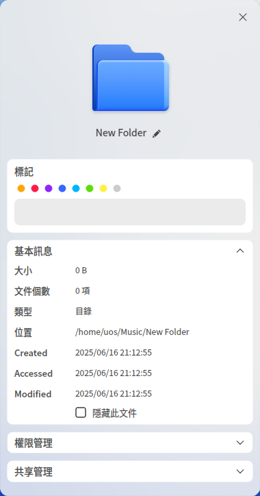

>  說明：查看多個文件屬性會顯示文件總大小和數量；查看捷徑的屬性將會額外顯示來源文件地址。您還可以使用 **Ctrl + I** 組合鍵查看文件屬性。

## 常用操作

檔案管理器具備很多特色功能，這些功能都讓文件管理更加簡單、高效。

### 切換地址欄

網址列整合瀏覽紀錄、路徑階層與輸入框，預設顯示路徑階層。

- **瀏覽紀錄**：使用箭頭切換前後瀏覽位置。
- **路徑階層**：點選任一層級快速跳轉。懸停點選 ▼ 展開完整路徑。  

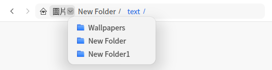

- **路徑輸入**：點選空白處輸入/編輯路徑，點選外部返回路徑階層。  

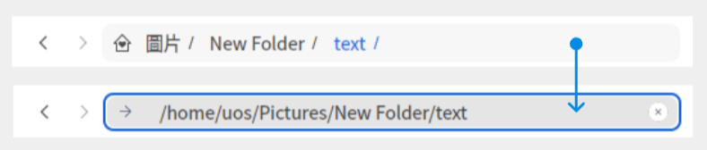

### 搜尋文件

按 **Ctrl + F** 或點選網址列搜尋圖示開始搜尋。  

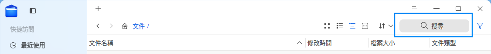

支援關鍵字（名稱/內容）及進階篩選（類型/大小/時間）。

- 先進入目標目錄再搜尋可限定範圍。
- 用空格分隔多組關鍵字。

> 說明：設定中預設啟用 **自動索引內接硬碟**，勾選 **連接後索引外接儲存裝置** 可加速外接裝置搜尋。

#### 全文搜尋

以檔案內容關鍵字搜尋。

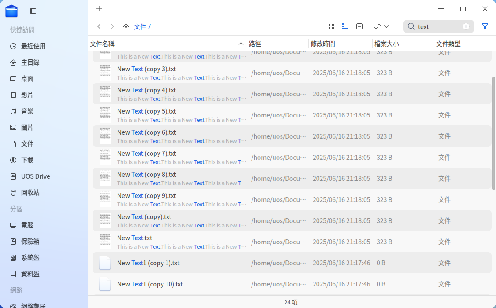

啟用方式：

1. 前往  > **設定**。
2. 於 **進階設定 > 搜尋** 勾選 **全文搜尋**。  

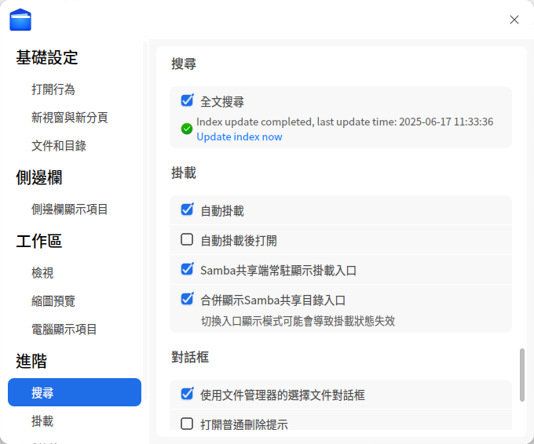

#### 進階搜尋

輸入關鍵字後點選 ，依條件篩選：  

- 範圍
- 檔案大小
- 檔案類型
- 修改/存取/建立時間  

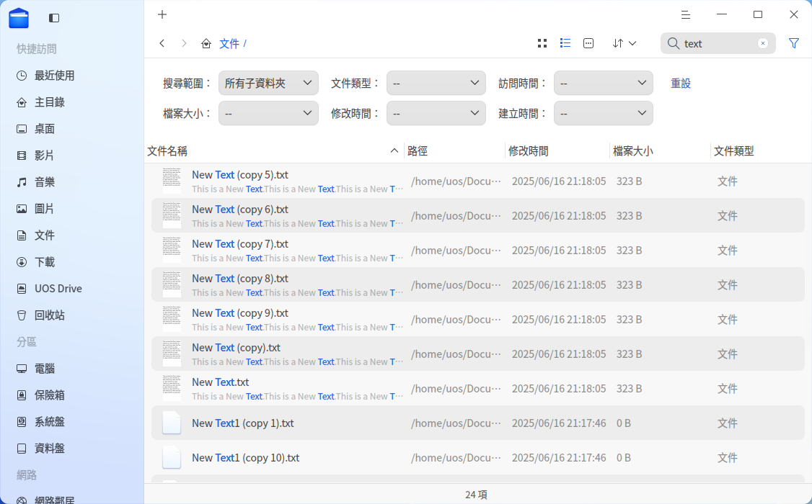

### 最近使用

在左方面板上預設有 **最近** 入口，單擊可以查看最近使用的文件項目。文件預設按照訪問時間倒序排列。

>  說明：若想隱藏「最近」，可在設定 > 基本設定 > 隱藏文件，取消勾選「在左方面板顯示最近文件項目」。若要隱藏某一個文件的訪問記錄，右擊該文件選擇 **移除**，該操作不會刪除文件。

### 多分頁

- 點選分頁列 **+** 新增分頁。
- 點選 **×** 或中鍵點選分頁關閉。  

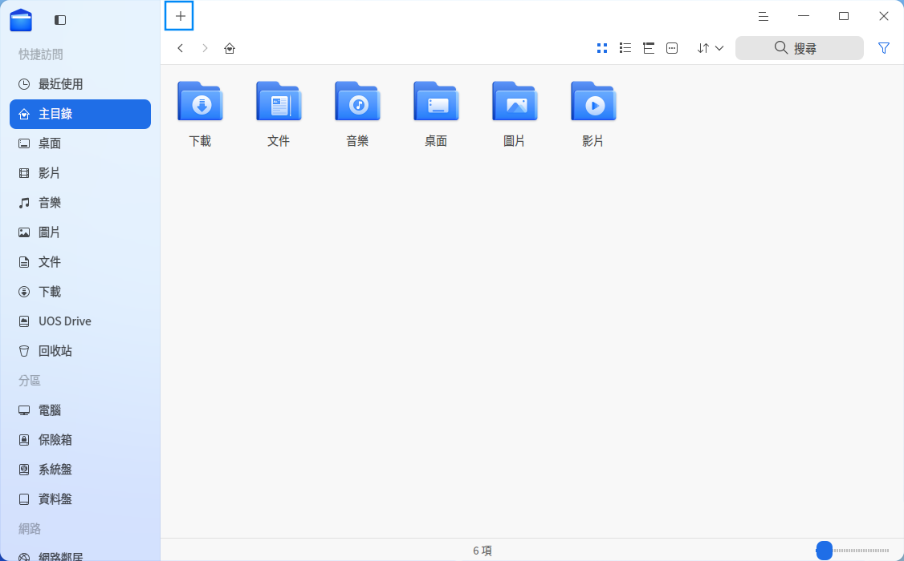**在新分頁開啟資料夾**：

1. 按右鍵點選資料夾。
2. 選擇 **在新分頁中開啟**。  

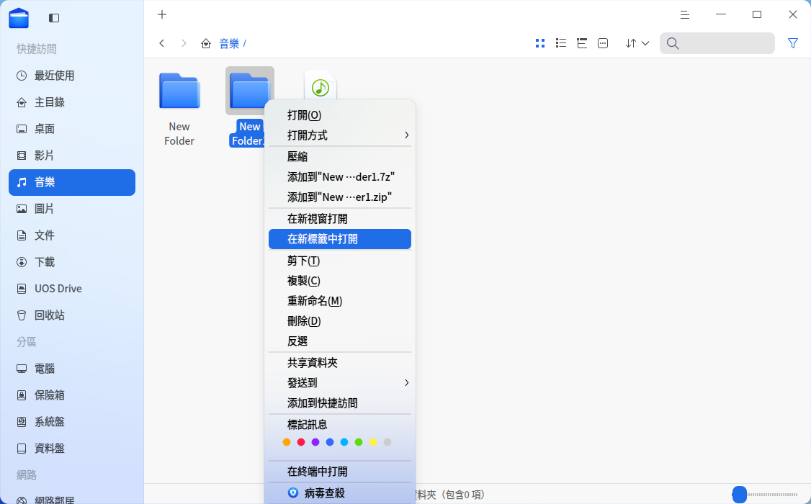

### 書籤管理

為常用資料夾添加書籤，以便從左側導航欄快速訪問。

- 添加書籤：右鍵單擊資料夾，選擇 **添加到快捷訪問** 在導航欄建立書籤。
- 移動書籤：在導航欄上下拖動書籤調整書籤排序。
- 刪除書籤：右鍵單擊書籤，選擇 **從快捷訪問移除** 來刪除書籤。

### 標記内容

透過給資料（夾）添加標記，可以更好地分類管理您的文件。

>  說明：目前僅x86平台支援 **標記内容** 功能。

#### 添加標記

您可以一次為多個文件（資料夾）添加標記，一個文件（資料夾）也可以添加多個標記；添加成功的標記會出現在左側導航欄內。

##### 透過編輯框添加標記

1. 右鍵單擊文件（資料夾），選擇 **標記内容**。
2. 輸入標記名稱。若要添加多個標記，用逗號分隔。
3. 編輯完成後單擊空白處儲存設定。

>  說明：標記顏色從8種預設顏色中隨機分配。

##### 透過顏色按鈕添加標記

右鍵單擊文件（資料夾），選擇「顏色按鈕」，直接生成這個顏色的標記。

##### 透過右側訊息欄添加標記

選擇文件（資料夾）後，單擊 ，在右側訊息欄中也可以添加標記。

>  說明：複製或剪下有標記的文件，所產生的文件仍然具有同樣的標記。

#### 重新命名標記

在側邊導航欄中，右鍵單擊某個標記，選擇 **重新命名**，修改目前標記的名稱。

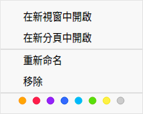

#### 修改標記顏色

在左側導航欄中，右鍵單擊某個標記，選擇「顏色按鈕」，即可修改目前標記的顏色。

#### 排序標記

上下拖動標記即可調整標記排序。

#### 刪除標記

右鍵單擊某個標記，選擇 **移除**，刪除目前標記。

### 文件預覽

檔案管理器支援空白鍵預覽功能，選中文件並按下鍵盤上的空白鍵就可以快速預覽文件。預覽視窗可以查看圖片解析度、文件大小、文字內容等，還支援gif、音訊、影片播放。

#### 預覽影片

1. 選擇您要預覽的影片文件，按下空白鍵，即可開始預覽。
2. 單擊影片任意地方可暫停播放。
3. 播放過程中，可以拖動進度條來快進快退。
4. 單擊底部 **打開** 按扭，在預設程式中打開該影片文件。

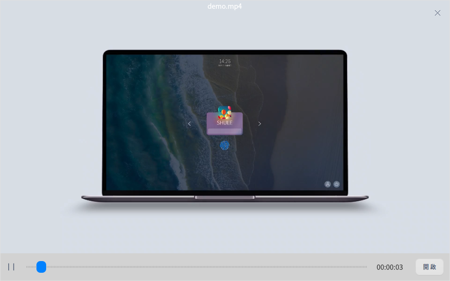

>  說明：您也可以同時選擇多個文件，按下空白鍵進行預覽。

### 權限管理

選擇對應文件/資料夾，單擊右鍵，選擇屬性，單擊 **存取權限**， 為擁有者，群組，和其他使用者設定文件權限。

### 我的共享

當您設定了共享資料夾時，「我的共享」將會出現在導航欄上。

#### 共享本機文件

共享本機文件，方便區域網路中的其他使用者查看、編輯或下載文件，提升辦公效率。

共享文件需要啟動smb服務，首次使用文件共享功能時，系統會彈出「啟動smb服務認證」視窗，輸入登入密碼完成認證即可打開smb服務。

1. 在檔案管理器介面，右鍵單擊資料夾，選擇 **共享資料夾**。
2. 在資料夾的屬性視窗，勾選 **共享資料夾**。
3. 設定文件共享名、權限和是否允許匿名訪問。
4. 單擊 **設定密碼**。
5. 彈出「輸入共享密碼」視窗，輸入密碼，單擊 **確定**。

當設定了共享密碼後，介面會顯示「修改密碼」，您可以在此修改共享密碼，或者在檔案管理器主選單中單擊 **設定共享密碼** ，修改共享密碼。

>  竅門：單擊網路路徑和使用者名稱右側的複製按鈕 ， 將訪問路徑和使用者名稱複製到剪貼簿，便於您將訊息分享給訪問者。

#### 訪問共享文件

區域網路中的使用者可以透過共享者提供的網路路徑訪問共享文件。

1. 透過以下方法之一訪問共享文件。
   
   - 直接在地址欄中輸入伺服器地址（例如：smb://10.0.2.15），按下鍵盤上的 **Enter** 鍵。
   - 單擊  > **連線到伺服器**，輸入伺服器地址，單擊 **連接**。

2. 選擇需要訪問的共享資料夾，彈出「要分享10.0.2.15上的XX需要密碼」的視窗。
   
   - 如果該資料夾設定為不允許匿名訪問，則在「註冊使用者」頁簽中輸入共享者的系統使用者名稱和共享密碼。
   - 如果該資料夾設定為允許匿名訪問，在「註冊使用者」頁簽中輸入共享者的系統使用者名稱和共享密碼；在「匿名」頁簽中則不需要輸入使用者名稱和密碼。

3. 選擇是否記住密碼，單擊 **連線**。

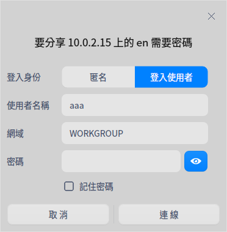

#### 取消共享文件

當取消了所有共享文件後，左側導航欄上「我的共享」則會移除，您可以透過以下方法之一取消本機共享文件。

- 右鍵單擊已共享的資料夾，選擇 **取消共享**。
- 右鍵單擊已共享的資料夾，選擇 **屬性**，在屬性視窗共享管理區域中取消勾選 **共享此資料夾**。
  
  

### 以管理員身份開新視窗

前提條件：「控制中心」>「一般設定」中開發者模式已打開。

1. 在檔案管理器介面空白處單擊滑鼠右鍵。
2. 選擇 **以管理員身份開新視窗**，在彈出的視窗中輸入使用者密碼，單擊 **確定**。
3. 該資料夾會以新視窗打開，在此視窗中可以進行進階權限的操作，關閉視窗後，終止管理員權限。

### 開啟終端機

1. 在檔案管理器介面空白處單擊滑鼠右鍵。
2. 選擇 **開啟終端機**，會啟動終端應用程式，終端的路徑為目前目錄。

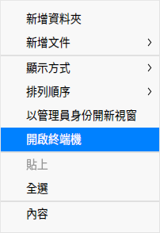

### 燒錄光碟

您可以透過燒錄功能將音樂、影片、圖片或鏡像文件複製到光碟中。請準備一張CD或DVD光碟和一台具備燒錄功能的裝置，才能執行如下操作。

<table class=block1>
<tr>
   <th align=left>類型</th>
   <th align=left>光碟格式</th>
   <th align=left>ISO9660</th>
   <th align=left>UDF</th>
</tr>
<tr>
   <td rowspan="2">空盤</td>
   <td>DVD-R、DVD+R、CD-R、CD-RW</td>
   <td>支援</td>
   <td>支援</td>
</tr>
<tr>
   <td>非DVD-R、DVD+R、CD-R、CD-RW</td>
   <td>支援</td>
   <td>不支援</td>
</tr>
<tr>
   <td rowspan="2">非空盤</td>
   <td>DVD-R、DVD+R、CD-R、CD-RW</td>
   <td>支援追加文件</td>
   <td>僅支援Windows原生工具燒錄的格式</td>
</tr>
<tr>
   <td>非DVD-R、DVD+R、CD-R、CD-RW</td>
   <td>支援追加文件</td>
   <td>不支援追加文件</td>
</tr>   
</table>

#### 燒錄本機文件

1. 在檔案管理器介面，單擊導航欄中的光碟圖示，進入光碟燒錄介面。

2. 將需要燒錄的文件（夾）拖曳至光碟燒錄介面，或右鍵單擊 文件（夾），選擇 **添加至光碟燒錄**。
3. 單擊介面右上角 **燒錄** 按鈕。
4. 彈出「光碟名稱」視窗，輸入光碟名稱。您也可以單擊 **進階設定** 進入進階設定介面，設定檔案系統、寫入速度，或勾選「允許追加資料」、「核驗資料」等，單擊 **燒錄**。

5. 彈出「燒錄完成」提示框，單擊 **確定** 完成燒錄。

#### 擦除光碟

1. 在檔案管理器介面，右鍵單擊導航欄中的光碟圖示。
2. 選擇 **移除**，再次右鍵單擊該光碟圖示並選擇 **清除**。
3. 彈出「確定擦除光碟內容」提示框，單擊 **清除**。

#### 存為鏡像文件

1. 在檔案管理器界面，單擊導航欄中的光碟圖示，進入光碟燒錄界面。

2. 單擊界面右上角 **存為鏡像文件** 按鈕，彈出“存為鏡像文件”窗口。

3. 您可以選擇指定路徑後單擊 **創建鏡像**，完成光碟鏡像文件的保存。

### 建立捷徑

1. 在檔案管理器介面上，右鍵單擊文件或資料夾。
2. 選擇 **建立連結**。
3. 在跳出視窗中選擇建立位置、連結名稱。
4. 單擊 **儲存**，在目標位置會生成該文件(夾)的捷徑。

>  竅門：選擇 **傳送到桌面** 可以直接在桌面上生成該文件(夾)的捷徑。

### 傳送文件到外接磁碟

當有外接磁碟接入時，您可以將文件或資料夾發送到外接磁碟。

1. 在檔案管理器介面上，右鍵單擊文件或資料夾。
2. 選擇 **傳送到** > 外接磁碟。
3. 文件或資料夾將會被傳送到移動外接磁碟。

### 傳送文件到藍牙

若您的電腦配備了藍牙模組，便可透過藍牙進行短距離文件傳輸的操作。

前提條件：傳送端與接收端藍牙設備已配對並成功連接。具體連接方法可參考 [連接藍牙設備](dman:///dde#連接藍牙設備)。

1. 在檔案管理器界面，右鍵單擊需要傳送的文件或文件壓縮包。
2. 選擇 **傳送到** > **傳送到藍牙**。
3. 在彈出的藍牙文件傳輸視窗中勾選接收設備，單擊 **下一步**。
4. 此時接收端會收到文件接收的請求，待接收端同意請求後，傳送端開始傳輸文件。

## 文件角標

您可以透過命令列，將圖示文件指定給一個文件或資料夾作為角標顯示出來。

>  說明：
> 
> - 角標文件支援svg、jpg、png、bmp、gif格式，且大小不超過100KB。
> - 隨身碟及光碟下的文件，不支援添加角標。

### 添加單個角標

1. 在終端輸入指令 **gio set xxx(文件路徑)  -t stringv metadata::emblems "xxx(圖示路徑)"** ，該指令預設在文件（夾）右下角添加角標。
   
   >  注意：系統已定義的特殊角標，不支援被取代。

2. 您也可以在上述指令中加入位置參數，將角標添加在文件（夾）的左上角（lu）、左下角（ld）、右上角（ru）或右下角（rd）。

例如：在文件（夾）左上角添加角標

**gio set xxx(文件路徑)  -t stringv metadata::emblems "xxx(圖示路徑);lu"**

### 添加多個角標

在命令列中加入**|**符號將角標文件路徑連結起來，為文件（夾）添加2~4個角標。文件（夾）同一個位置不支援疊加角標，僅支援取代。

例如：在文件（夾）四個角都添加角標

**gio set xxx(文件路徑)  -t stringv metadata::emblems "xxx(圖示路徑);lu|xxx(圖示路徑);ld|xxx(圖示路徑);ru|xxx(圖示路徑);rd"**

### 復原角標

在終端中輸入指令 **gio set xxx(文件路徑) -t stringv metadata::emblems ""** 復原文件（夾）上所有的角標。

## 文件保險箱

文件保險箱旨在為您打造專屬的安全空間，為您的隱私保駕護航。先進的加密技術，便捷的操作流程，使用起來得心應手。

### 加密保險箱

保險箱現提供兩種加密方式，分別為 **金鑰加密** 和 **透明加密**，新增的 **透明加密** 提供了無需輸入保險箱密碼，即可訪問保險箱的便捷加密方式，該加密方式同樣確保了保險箱內文件的安全。

#### 透明加密

1. 單擊導航欄中的保險箱圖示 ，或者在計算機界面雙擊 “我的保險箱”，在彈出的對話框中單擊 **開啟**。 
2. 在“加密方式”下，選擇 **透明加密** 後單擊 **下一步**，直接加密保險箱。

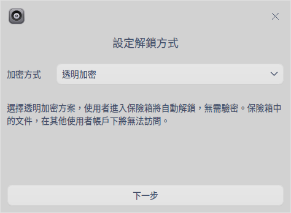

#### 金鑰加密

1. 單擊導航欄中的保險箱圖示 ，或者在計算機界面雙擊 “我的保險箱”，在彈出的對話框中單擊 **開啟**。 
2. 加密方式預設為 **金鑰加密**，可設置保險箱密碼和密碼提示訊息，單擊 **下一步**。

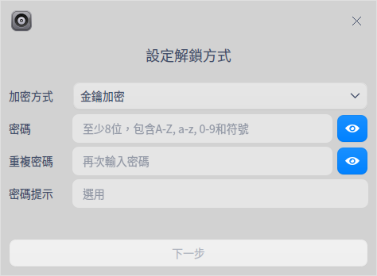

>  說明: 密碼必須同時包含大寫字母、小寫字母、數字和符號，且字元不小於8位，否則無法進入下一步。

3. 在儲存金鑰文件視窗中，設定金鑰文件的儲存位置，如果您忘記了保險箱密碼，可使用金鑰文件找回密碼。單擊 **下一步**。

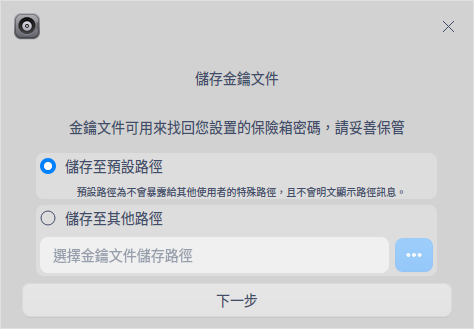

4. 單擊 **加密保險箱**，彈出認證視窗，輸入使用者登入密碼後單擊 **確定**。

5. 在加密完成對話框中單擊 **確定**， 完成保險箱密碼設定。

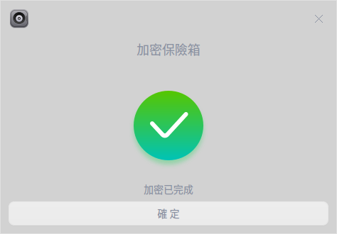

### 鎖定保險箱

將文件放入保險箱後，右鍵單擊導航欄  圖示或者在電腦介面右鍵單擊「我的保險箱」。

- 選擇 **立即上鎖**，立即將文件保險箱鎖上。
- 選擇 **自動上鎖**，在其下拉選單進行設定：
  + 選擇「永不」，電腦在鎖定螢幕或關機前一直保持未上鎖狀態。
  + 選擇「5分鐘」、「10分鐘」或者「20分鐘」後自動上鎖保險箱。

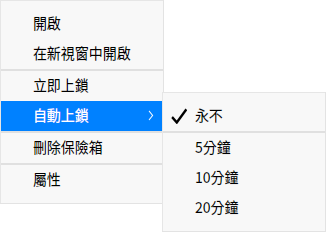

### 解鎖保險箱

1. 單擊  或者在電腦介面雙擊 **我的保險箱**。
2. 在解鎖保險箱的視窗中，輸入保險箱密碼，單擊 **解鎖**。
3. 如果忘記了保險箱密碼，單擊 **忘記密碼**，選擇金鑰文件的儲存位置後，單擊 **驗證金鑰** 找回密碼。

> 竅門：您也可以右鍵單擊  或者 **我的保險箱**，選擇 **解鎖**，解鎖保險箱。

### 刪除保險箱

刪除保險箱需要提前解鎖保險箱。

1. 右鍵單擊導航欄  圖示或者在電腦介面右鍵單擊 「我的保險箱」，選擇 **刪除保險箱**。

2. 在彈出的刪除保險箱視窗中輸入保險箱密碼，單擊 **刪除**。

3. 在彈出的認證視窗中輸入使用者登入密碼，單擊 **確定** 完成刪除操作。
   
   >  注意：刪除保險箱會將裡面的文件永久刪除。在進行刪除操作前，請將保險箱中的文件備份。

## 磁碟管理

檔案管理器可以管理本機和外接磁碟。

### 查看磁碟

您的本機磁碟會顯示在檔案管理器的左側導航欄上。當您掛載外接磁碟或者插入其他移動儲存裝置時，也會在導航欄上看到相應的磁碟圖示。

<table class="block1">
    <caption></caption>
    <tbody>
        <tr>
            <td>本機磁碟</td>
            <td>本機硬碟分區的所有磁碟</td>
        </tr>
        <tr>
            <td>外接磁碟</td>
            <td>包括行動硬碟、隨身碟、光碟</td>
        </tr>
        <tr>
            <td>移動裝置</td>
            <td>手機記憶體、記憶卡、SD卡等</td>
        </tr>
    </tbody>
</table>

>  說明：如果磁碟或磁碟中的資料夾被加密了，請輸入密碼後查看文件。

### 本機磁碟

#### 隱藏內建磁碟

1. 在檔案管理器介面，單擊  > **設定**。
2. 在進階設定選項中勾選 **電腦工作區隱藏內建磁碟**。在 進階設定 > 側邊欄顯示項目中取消勾選 內建磁碟。

#### 重新命名本機磁碟

1. 在左側導航欄或電腦介面，右鍵單擊需要重新命名的本機磁碟。
2. 選擇 **重新命名**。
3. 輸入新名稱後按下鍵盤上的 **Enter** 鍵或單擊空白處儲存修改。

>  竅門：在電腦介面，慢速雙擊本機磁碟，呈現編輯框後便可進行重新命名操作。

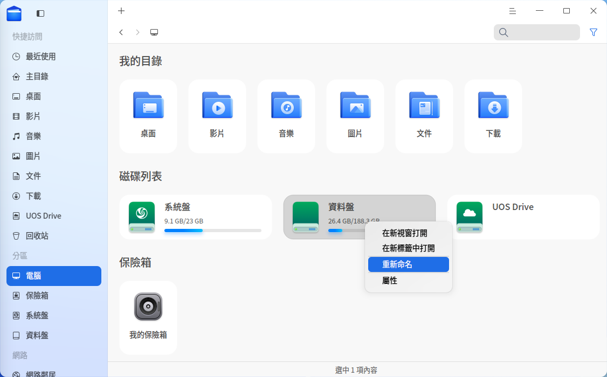

### 外接磁碟

#### 彈出外接磁碟

1. 在左側導航欄或電腦介面，右鍵單擊需要移除的磁碟。
2. 選擇 **安全移除**。
3. 磁碟將從磁碟列表中刪除，一併彈出該磁碟的所有分區。

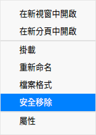

>  竅門：如果要彈出光碟，請選擇 **彈出** 來移除光碟。單擊導航欄中磁碟右邊的  同樣可以彈出磁碟或光碟。

#### 重新命名外接磁碟

1. 在左側導航欄或電腦介面，右鍵單擊需要重新命名的磁碟。
2. 選擇 **移除** 後，再次單擊右鍵選擇 **重新命名**。
3. 輸入新的卷標名稱，按下鍵盤上的 **Enter** 鍵或單擊空白處儲存修改。

#### 格式化外接磁碟

1. 在左側導航欄或電腦介面，右鍵單擊需要格式化的磁碟。
2. 選擇 **卸载**，再次單擊右鍵選擇 **檔案格式**。
3. 在格式化跳出視窗中設定格式化之後的文件類型和卷標。
4. 單擊 **格式化**。

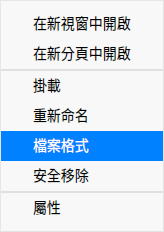

>  說明：快速格式化速度快，但是資料仍然可能透過工具被復原，如果想要格式化後的資料無法被復原，可以取消勾選「快速格式化」，然後執行格式化操作。

## 主選單

在主選單中，您可以新增視窗、切換視窗主題、連線到伺服器、設定共享密碼（見[共享本機文件](#共享本機文件)）、設定檔案管理器、查看說明手冊和版本介紹。

### 新增視窗

1. 在檔案管理器介面，單擊 。
2. 單擊 **新增視窗**，打開一個新的檔案管理器視窗。

### 連線到伺服器

透過連接伺服器[訪問共享文件](#訪問共享文件)。

1. 在檔案管理器介面，單擊 > **連線到伺服器**。

2. 彈出「連線到伺服器」視窗，在協議下拉框中，選擇一種連接協議；在地址欄輸入伺服器IP位址。
   
   >  竅門：您可以單擊  ，將常用伺服器地址添加到「我收藏的伺服器」列表中。

3. 單擊 **連線**。
   
   

### 設定

在檔案管理器介面，單擊 > **設定**，可進行基本設定和進階設定。

#### 基本

- **開啟行為**：設定資料夾是否在新視窗開啟/雙擊/單擊開啟檔案。
- **新視窗與分頁**：設定開啟目錄的預設行為。
- **檔案與目錄**：切換 *顯示隱藏檔案*、*顯示副檔名* 或 *混合排序檔案/資料夾*。  

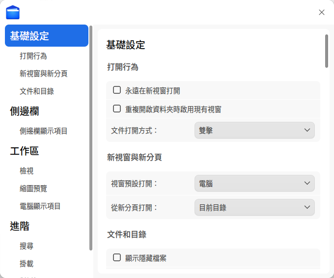

#### 側邊欄

- **顯示項目**：自訂捷徑存取、分割區、網路及標籤的顯示項目。

#### 工作區

- **檢視**：設定預設圖示尺寸、檢視模式及排序。
- **縮圖預覽**：設定預覽檔案類型。
- **電腦顯示項目**：選擇顯示的分割區與標籤。

#### 進階設定

- **搜尋**：啟用全文搜尋及手動更新索引。
- **掛載**：自動掛載外接裝置、掛載後開啟或顯示 Samba 項目。
- **對話框**：使用檔案管理員選取檔案或啟用刪除確認。
- **檔案傳送**：設定分享權限及儲存位置。

### 主題

視窗主題包含亮色主題、暗色主題和系統主題。

1. 在檔案管理器介面，單擊 。
2. 單擊 **主題**，選擇一個主題。

### 說明

查看說明手冊，進一步了解和使用檔案管理器。

1. 在檔案管理器介面，單擊 。
2. 單擊 **說明**。
3. 查看檔案管理器的說明手冊。

### 關於

1. 在檔案管理器介面，單擊 。
2. 單擊 **關於**。
3. 查看檔案管理器的版本和介紹。

### 退出

1. 在檔案管理器介面，單擊 。
2. 單擊 **退出**。
