# 深度文件管理器|../common/deepin-feedback.svg|

## 概述|../common/icon_overview.svg|

深度文件管理器是深度科技开发的一款功能强大、简单易用的文件管理工具，沿用经典的文件管理器的功能和布局，并在其基础上简化用户操作，增加特色功能。一目了然的导航栏、智能识别的搜索框、多种视图和排序让您管理起来得心应手，本地文件、回收站、磁盘、网络邻居让您掌控全局。经典和超越，只为给您更好的体验。

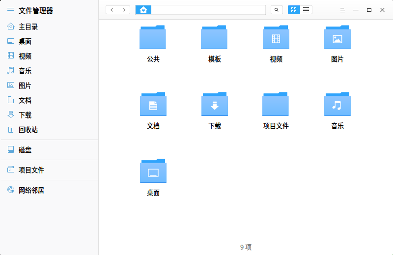

## 使用入门|../common/icon_guide.svg|

您可以通过以下方式运行或关闭深度文件管理器，或者创建深度文件管理器的快捷方式。

### 运行深度文件管理器

1. 点击桌面底部的 或将鼠标指针移到屏幕左上角，进入启动器界面。
2. 上下滚动鼠标滚轮，通过浏览找到文件管理器  进行点击。
3. 将鼠标指针置于深度文件管理器应用程序的图标上，右键单击   图标，您可以：
 - 点击 **发送到桌面**，在桌面创建快捷方式。
 - 点击 **发送到任务栏**，将应用程序固定到任务栏。
 - 点击 **开机自动启动**，将应用程序添加到开机启动项，在电脑开机时自动运行该应用程序。

### 关闭深度文件管理器

- 在深度文件管理器界面点击   ，退出深度文件管理器。
- 在任务栏右键单击  ，选择 **关闭所有** 来退出深度文件管理器。
- 在深度文件管理器界面点击  ，选择 **退出** 来退出深度文件管理器。

### 查看快捷键表

按下键盘上的  +  +  键打开深度文件管理器的快捷键列表，熟练的使用快捷键可以大大提升操作效率。

## 主界面|../common/icon_appinterface.svg|

深度文件管理器的主界面简单易用、功能全面，熟练的使用界面功能将使文件管理更加简单高效。

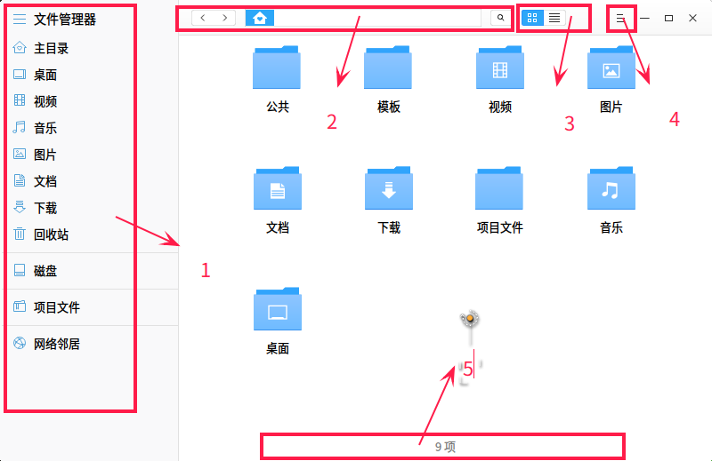

<table class="block1">
    <caption></caption>
    <tbody>
        <tr>
            <td>1</td>
            <td>导航栏</td>
            <td>通过点击导航图标可以快速访问本地文件、磁盘、网络邻居、书签等。</td>
        </tr>
        <tr>
            <td>2</td>
            <td>地址栏</td>
            <td>通过地址栏可以快速切换访问历史、在上下级目录间切换、搜索、输入地址访问。详细介绍请参考[切换地址栏](#切换地址栏)。</td>
        </tr>
		<tr>
            <td>3</td>
            <td>视图栏</td>
            <td>通过点击  ,  图标来切换文件视图。</td>
        </tr>
		<tr>
            <td>4</td>
            <td>菜单栏</td>
            <td>通过主菜单您可以新建窗口、修改设置、查看帮助文档、关于深度文件管理器、退出深度文件管理器。</td>
        </tr>
			<tr>
            <td>5</td>
            <td>状态栏</td>
            <td>显示文件数目或者已选中文件数目。通过拖动滚动条可以调整主界面上的图标大小。</td>
        </tr>
    </tbody>
</table>

## 基本功能|../common/icon_basicoperation.svg|

深度文件管理器具备基本的文件管理功能，对文件(夹)进行新建、复制、重命名、删除等操作都非常简单。

### 新建文件(夹)

#### 新建文件

1. 在深度文件管理器界面上，点击鼠标右键。
2. 点击 **新建文档**。
3. 选择新建文件的类型。
4. 输入新建文件的名称。

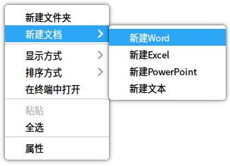

#### 新建文件夹

1. 在深度文件管理器界面上，点击鼠标右键。
2. 点击 **新建文件夹**。
3. 输入新建文件夹的名称。

### 重命名文件(夹)

1. 在深度文件管理器界面上，右键单击文件。
2. 选择 **重命名**。
3. 输入文件(夹)名称，按  键或者鼠标点击界面空白区域。

### 复制文件(夹)

1. 在深度文件管理器界面上，右键单击文件(夹)。
2. 点击 **复制**。
3. 选择一个目标存储位置。
4. 点击鼠标右键，然后选择 **粘贴**。

### 压缩文件(夹)

1. 在深度文件管理器界面上，右键单击文件。
2. 点击 **压缩**。
3. 输入压缩包名称，选择压缩包类型和目标存储位置。
4. 点击 **创建**。

> ：在压缩文件弹窗中您也可以点击 **其他选项** 设置解压密码和设置分卷大小，解压密码和分卷压缩仅支持部分压缩格式。

> ：当压缩文件较大时会出现进程提示弹窗，点击弹窗上的按钮可以暂停或者取消压缩。

### 删除文件(夹)

1. 在文件管理器界面上,右键单击文件(夹)。
2. 选择 **移动到回收站** 即可删除文件(夹)。

- 被删除的文件(夹)可以在回收站中找到，右键单击文件(夹)可以进行 **还原** 或 **彻底删除** 操作。
- 被删除的文件(夹)的快捷方式将会失效。

### 打开方式

1. 在文件管理器界面上，右键单击文件。
2. 选择 **打开方式**。
3. 在程序列表中选择应用程序。

> ：直接双击文件会使用默认程序打开文件，设置文件默认打开方式的具体操作请参考 [默认启动设置](dman:///dde-control-center#默认程序设置)。

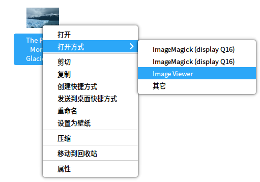

### 显示方式

通过点击界面上的  、  图标来切换图标视图、列表视图。

#### 图标视图

平铺显示文件的图标、名称、缩略图，可以通过拖动界面底部滚动条可以调整缩略图大小。

#### 列表视图

列表显示文件图标、名称、修改时间、大小、类型等信息。

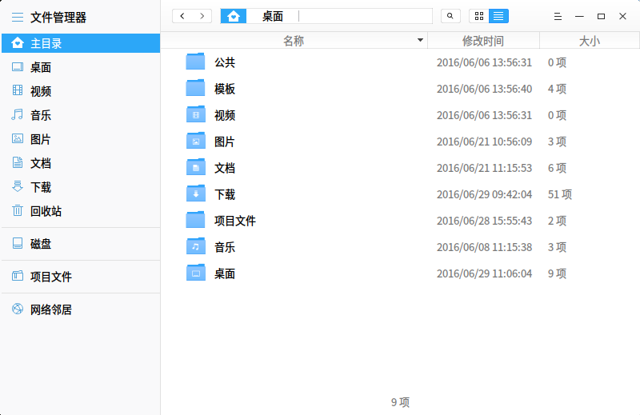

### 排序方式

1. 在文件管理器界面上单击鼠标右键。
2. 选择 **排序方式**。
3. 在子菜单中选择一种排序方式。

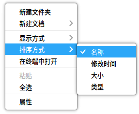

> ：列表视图中可以点击表头栏的列标签来切换排序。

### 文件(夹)属性

在文件管理器界面上右键单击文件，选择 **属性**，查看文件(夹)属性。

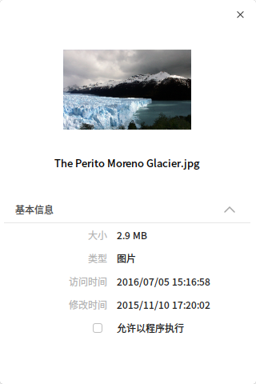

## 常用操作|../common/icon_basicoperation.svg|

深度文件管理器具备很多特色功能，这些功能都是为了让文件管理更加简单、高效。

### 切换地址栏

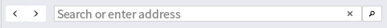

地址栏由历史导航、面包屑、输入框共同组成，通常情况下地址栏会显示面包屑，当用户点击输入框区域或者搜索图标时，地址栏会切换为输入框状态，失去焦点或者再次点击搜索图标，地址栏会恢复到面包屑状态。

- 通过点击历史导航图标，您可以快速在历史浏览记录间切换，查看前一个地址或者后一个地址。
- 文件所在位置的每一个层级都会形成一个面包屑，通过来回点击面包屑可以快速在不同文件层级间切换。
- 输入框带有智能识别功能，可以直接输入搜索关键词或者访问地址，系统会自动识别和判断。

### 搜索文件

在文件管理器输入框中输入关键词搜索相关文件。

- 需要指定目录搜索时，请先进入该目录，然后再进行搜索。
- 需要全盘搜索时，请在输入框中输入/并按下键盘上的回车键，然后再进行搜索。

### 管理书签

- 添加书签：右键单击文件管理器中的文件夹，选择 **添加书签**就可以在导航栏创建书签。

- 移动书签：在导航栏可以用鼠标左键按住书签进行拖动，通过拖动可以调整书签排序，将书签拖动到导航栏之外放开鼠标可以直接删除书签。

- 删除书签：右键单击书签，选择 **删除书签**来删除书签，也可以将书签拖到导航栏之外来删除书签。

### 网络邻居

1. 点击深度文件管理器导航栏上的网络邻居 图标。
2. 双击想要访问的网络文件。

 - 未加密的网络文件可以直接访问。
 - 加密的网络文件会弹出登陆框，输入账号和密码之后才能访问。如果在用户名密码提示框中勾选 **记住密码** ，再次访问不再需要密码。

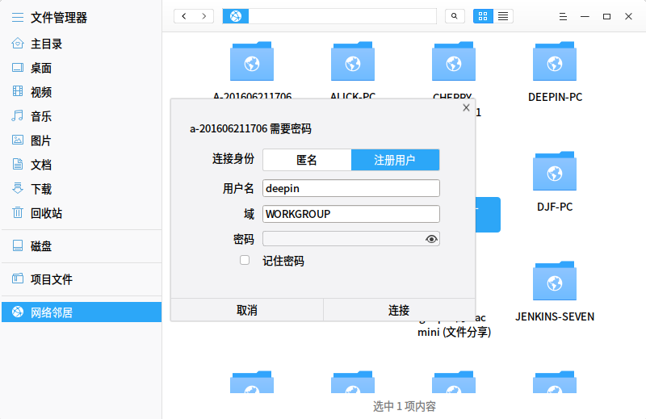

### 从终端中打开

在文件管理器界面空白处单击鼠标右键，选择 **从终端中打开**，会启动深度终端并前置，终端的路径为当前目录。

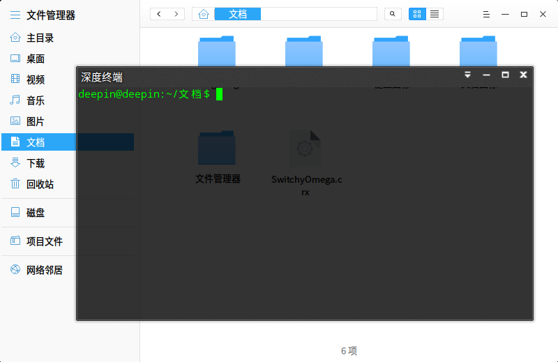

### 创建快捷方式

1. 在文件管理器界面上，右键单击文件(夹)。
2. 选择 **创建快捷方式**。
2. 在弹窗中选择创建位置、链接名称。
3. 点击 **保存**，在目标位置会生成该文件(夹)的快捷方式。

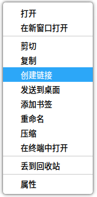

> ：选择 **发送到桌面快捷方式**可以直接在桌面上生成该文件(夹)的快捷方式。

## 磁盘管理|../common/icon_basicoperation.svg|

### 显示磁盘

点击左侧栏的磁盘图标可以显示本地磁盘、外接磁盘、手机、存储卡等存储设备。

<table class="block1">
    <caption></caption>
    <tbody>
        <tr>
            <td>1</td>
            <td>本地磁盘</td>
            <td>本地硬盘分区的所有磁盘</td>
        </tr>
        <tr>
            <td>2</td>
            <td>外接磁盘</td>
            <td>包括移动硬盘、U盘、光盘</td>
        </tr>
		<tr>
            <td>3</td>
            <td>移动设备</td>
            <td>手机内存、存储卡、SD卡等</td>
        </tr>
    </tbody>
</table>

### 卸载/弹出磁盘

- 在文件管理导航栏右键单击磁盘图标，选择 **卸载** 来卸载磁盘，磁盘仍将在磁盘列表上存在。
- 在文件管理导航栏右键单击磁盘图标，选择 **弹出** 来弹出磁盘，磁盘将从磁盘列表中删除，并且可以从计算机上安全删除。

## 选项设置|../common/icon_basicoperation.svg|

点击深度看图界面上的  图标进行设置。

### 新建窗口

打开一个新的文件管理器窗口。

### 帮助

您可以点击帮助获取深度文件管理器的帮助手册，通过帮助进一步让您了解和使用深度文件管理器。

1. 在深度文件管理器界面，点击   。
2. 点击 **帮助**。
3. 查看关于深度文件管理器的帮助手册。

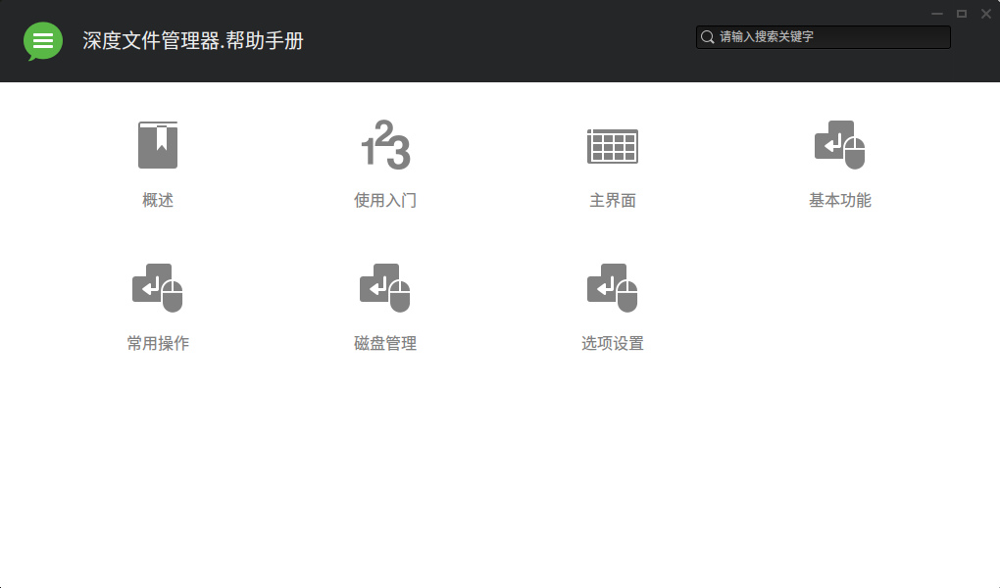

### 关于

您可以点击关于查看深度文件管理器的版本介绍。

1. 在深度文件管理器界面，点击   。
2. 点击 **关于**。
3. 查看关于深度文件管理器的版本和介绍。

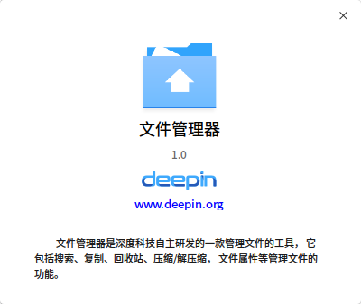

### 退出

您可以进入菜单栏点击退出深度文件管理器。

1. 在深度文件管理器界面，点击 。
2. 点击 **退出**。