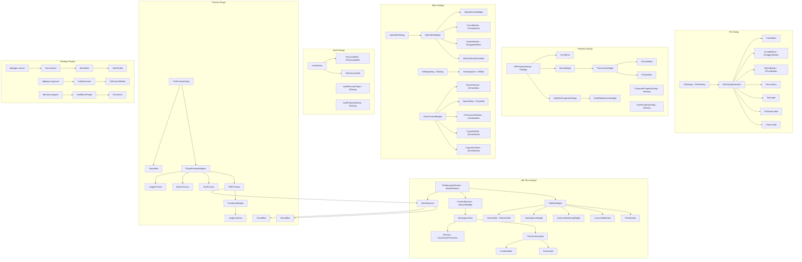

# dde-file-manager AT-SPI UI Map

## Overview

dde-file-manager（文件管理器）是 Deepin 桌面环境的文件管理核心应用。本文档基于源码静态分析，描述其 UI 组件结构、控件层次、AT-SPI 命名现状及补全清单。

## Component Tree

## Widget Directory Index

| Component | Header/Impl | Key Widgets |
|-----------|-------------|-------------|
| FileManagerWindow | `src/dfm-base/widgets/dfmwindow/` | DMainWindow, SideBar, CentralView |
| TitleBar | `src/plugins/filemanager/dfmplugin-titlebar/views/` | TitleBarWidget, SearchEdit, CustomTab |
| File View | `src/plugins/filemanager/dfmplugin-workspace/views/` | FileView, RenameBar, StatusBar |
| File Dialog | `src/plugins/filedialog/core/views/` | FileDialog, StatusBar |
| Property Dialog | `src/plugins/common/dfmplugin-propertydialog/views/` | FilePropertyDialog, BasicWidget |
| Open With | `src/plugins/common/dfmplugin-utils/openwith/` | OpenWithDialog, OpenWithWidget |
| Settings | `src/dfm-base/dialogs/settingsdialog/` | SettingDialog |
| Share Control | `src/plugins/common/dfmplugin-dirshare/widget/` | ShareControlWidget |
| PDF Preview | `src/apps/dde-file-manager-preview/pluginpreviews/pdf-preview/` | SheetBrowser, ThumbnailWidget |
| Music Preview | `src/apps/dde-file-manager-preview/pluginpreviews/music-preview/` | MusicMessageView, ToolBarFrame |
| Vault | `src/plugins/filemanager/dfmplugin-vault/views/` | UnlockView, VaultPropertyDialog |

## Menu Structure

The application uses dynamic menu generation through the `dfmplugin-menu` framework.
Key menu types:
- **Context menu** (right-click on files/folders)
- **Titlebar menu** (hamburger menu)
- **Bookmark menu** (sidebar right-click)
- **Tab context menu**

These menus are built programmatically via scene-based actions and do not have static AT-SPI names.

## Current AT-SPI Coverage

- `setAccessibleName` calls: **6** (4 in pdf-preview, 1 in settingdialog, 1 in testing)
- `setObjectName` calls: **79** (spread across ~40 files)
- AccessibleFactory (installFactory): **1** (testing module only)

Coverage is very low. Most interactive widgets lack AT-SPI names.